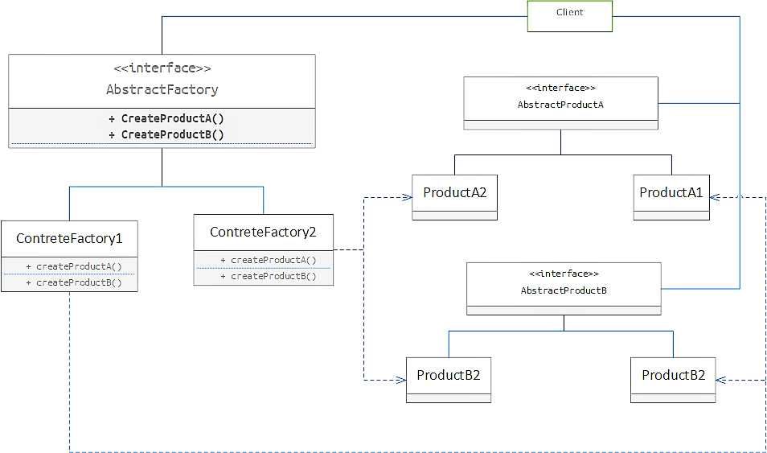
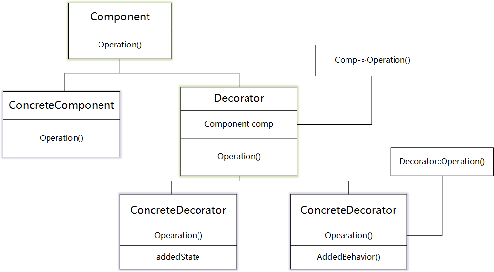
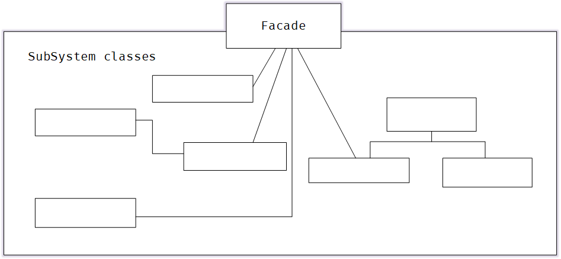
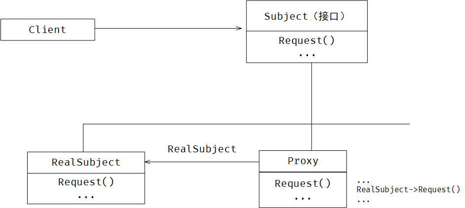
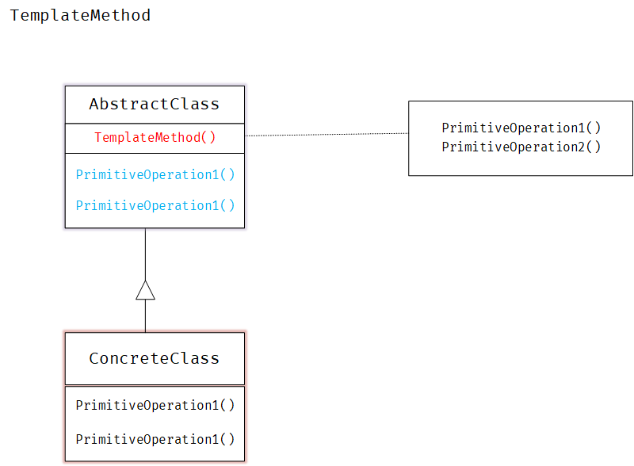

# Design Patterns

> 口号： **隔离变化，高内聚，低耦合**
>
> 目的：为了**重用代码**、让代码更容易被他人理解、保证代码可靠性


## 目录

### Creational

- [Factory Method](#FactoryMethod)
- [Abstract Factory](#AbstractFactory)
- [Builder](#Builder)
- [Prototype](#Prototype)
- [Singleton](#Singleton)


### Structural

+ [Adapter](#Adapter)

- [Bridge](#Bridge)
- [Composite](#Composite)
- [Decorator](#Decorator)
- [Facade](#Facade)
- [Flyweight](#Flyweight)
- [Proxy](#Proxy) 


### Behavioral

- [Chain Of Responsibil Ity](#ChainOfResponsibilIty)
- [Command](#Command)
- [Interpreter](#Interpreter)
- [Iterator](#Iterator)
- [Mediator](#Mediator)
- [Memento](#Memento)
- [Observer](#Observer)
- [State](#State)
- [Strategy](#Strategy)
- [Template Method](#TemplateMethod)
- [Visitor](#Visitor)


## 面向对象原则

1、**依赖倒置原则**（DIP）

+ 高度模块（稳定）不应该依赖于低层模块（变化），二者都应该依赖于抽象（稳定）
+ 抽象（稳定）不应该依赖于实现细节（变化），实现细节应该依赖于抽象（稳定）


2、**开放封闭原则**（OCP）

+ 对扩展开发，对更改关闭
+ 类模块应该是可扩展的，但是不可修改。


3、**单一职责原则**（SRP）

+ 一个类应该仅有一个引起它变化的原因
+ 变化的方向隐含着类的职责


4、**Liskov 替换原则**（LSP）

+ 子类必须能够替换它们的基类（IS-A）
+ 继承表达类型抽象


5、**接口隔离原则**（ISP）

+ 不应该强迫客户程序依赖它们不用的方法
+ 接口应该小而完善


6、**优先使用对象组合，而不是类继承**

+ 继承在某种程度上破环了封装性，子类父类耦合度高
+ 对象组合则只要求被组合的对象具有良好的接口，耦合度低


7、**封装变化点**

+ 使用封装来创建对象之间的分界线，让设计者可以在分界层的一侧进行修改，而对另一侧产生不良影响，


8、**针对接口编程，而不是针对实现编程**

+ 不降变量类声明为某个特定的具体类，而是声明为某个接口

+ 客户程序无需获得知对象的类型，只需要知道对象所具有的接口
+ 减少系统中各部分的依赖关系


# Creational 

> 定义： 创建型模式**抽象了实例化过程**（绕开new），帮助系统独立于如何创建对象、组合和表示那些对象。
>
> 特征： 1）它们将关于该系统使用那些**具体的类的信息封装起来**
>
> ​		2）它们**隐藏了这些类的实例是如何被创建和放在一起的**。	


## FactoryMethod

### Ⅰ模式意图

+ 定义一个用于创建对象的接口，让子类决定实例化哪一个类，factoryMethod使**一个类的实例化延迟到子类**。


### Ⅱ 模式适用

+ 当一个类不知道它所必须创建的对象的类的时候
+ 当一个类希望有它的子类来指定它所创建的对象的时候
+ 当类将创建对象的职责委托给多个帮助子类中的某一个，并且你希望将哪一个帮助子类是代理者这一信息局部化的时候


### Ⅲ 模式效果

+ Factory Method 模式解决**单个对象**的需求变化，缺点：**要求创建方法参数相同**
+ Factory Method 隔离类对象的使用者和具体类型之间的耦合关系，面对变化的具体类型，紧耦合关系（new）会让程序变脆弱。

+ 仅仅为了创建一个特定的ConcreteProduct对象，就不得不创建Creator的子类

+ 为子类提供挂钩

+ 连接平行的类层次


### Ⅳ 模式结构

+ `Product`：定义工厂方法所创建的对象的接口
+ `ConcreteProduct`： 实现Product的接口
+ `Creator`：工厂方法，返回一个Product类型的对象；可以调用工厂方法创建一个Product对象。
+ `ConcreteCreator`:  重定义工厂方法以返回一个ConcreteProduct实例。


> + Creator依赖于它的子类来定义工厂方法，所以它返回一个适当的ConcreteProduct实例


### Ⅴ 模式实现

+ 两种不同的情况

  + creator类是一个抽象类并且不提供它所声明的工厂方法的实现
  
  + creator是一个具体的类并且为工厂方法提供一个缺省的实现。

+ 参数化工厂方法

+ 特定语言的变化和问题

  + lazy initialization

+ 使用模板以避免创建子类


#### 标准版(c++)

```c++
// 行星抽象接口
class IPlanet {
 public:
  virtual void rotation() = 0;
  virtual ~IPlanet(){};
};

//工厂方法抽象接口
class ICreator {
 public:
  virtual IPlanet* createPlanet() = 0;
  virtual ~ICreator(){};
};
```

```c++
// 具体的产品：地球
class Earth : public IPlanet {
 public:
  virtual void rotation() { 
      printf("Earth rotation\n"); 
  }
};

// 具体的产品：火星
class Mars : public IPlanet {
 public:
  virtual void rotation() { 
      printf("Mars rotation\n"); 
  }
};

// 具体的工厂方法
class EarthCreator : public ICreator {
 public:
  virtual IPlanet* createPlanet() { 
      return new Earth(); 
  };
};

// 具体的工厂方法
class MarsCreator : public ICreator {
 public:
  virtual IPlanet* createPlanet() { 
      return new Mars(); 
  }
};
```

```c++
// 仅仅依赖抽象类型
void rotation(ICreator* creator) {
  IPlanet* planet = creator->createPlanet();
  planet->rotation();
  delete planet;
}

int main() {
  ICreator* creator1 = new EarthCreator();
  ICreator* creator2 = new MarsCreator();
  rotation(creator1);
  rotation(creator2);
  delete creator1;
  delete creator2;
}
```


[查看更多](/src/DesignPattern/Creational/FactoryMethod)


### Ⅵ 相关模式

+ abstract factory 经常用工厂方法来实现。

+ 工厂方法经常在Template Method中被调用
+ Prototypes不需要创建creator子类，但是通常需要一个针对Product类的Initialize操作
+ Creator使用Initialize来初始化对象，而factory method不需要这样的操作。


## AbstractFactory

### Ⅰ 模式意图

+ 提供一个创建一系列相关或互相依赖对象的接口，而无需指定它们的具体的类


### Ⅱ 模式适用

+ **一个系统要由多个产品系列中的一个来配置时**
+ 一个系统要独立于它的产品的创建、组合和表示时
+ 当你要强调**一系列相关的产品对象**的设计以便进行**联合**适用时
+ 当你提供一个产品类库，而只想显示它们的接口而不是实现时


### Ⅲ 模式效果

+ 它分离了具体的类
+ 它使得易于交换产品系列
+ 它有利于产品的一致性，**保证产品的相关性**
+ **难以支持新种类的产品**


### Ⅳ 模式结构

+ `AbstractFactory`: 创建抽象产品的操作接口
+ `ConcreteFactory`: 实现具体产品对象的操作
+ `AbstractProduct`: 一类产品对象的接口
+ `ConcreteProduct`: 定义一个将被相应的具体工厂创建的产品对象
+ `Client`:  仅使用由**`AbstractFactory`**和**`AbstractProduct`**类声明的接口




> + 通常在运行时刻创建一个ConcreteFactory类的实例。这一具体的工厂创建具有特定实现的产品对象。为创建不同的产品对象，客户应使用不同的具体工厂。
> + AbstractFactory将产品对象的创建延迟到它的ConcreteFactory子类


### Ⅴ 模式实现

+ 1、工厂作为单件

  + 一个应用中一般每个产品系列只需一个ConcreteFactory的实例，因此工厂通常最好实现为一个Singleton

+ 2、创建产品

  +  abstractfactory仅申明一个创建产品的接口，真正创建产品是由ConcreteProduct子类实现的，最通常的一个方法是为每个产品定义一个工厂方法。
  
  +  如果有多个可能的产品系列，具体的工厂也可以使用Prototype模式来实现

+ 定义可扩展的工厂

  +  参数化


#### 标准版(c++)

```c++
// 按钮接口
class Button {
 public:
  virtual void drawButton() = 0;
  virtual ~Button(){};
};

// 菜单接口
class Menu {
 public:
  virtual void drawMenu() = 0;
  virtual ~Menu(){};
};

// 抽象工厂接口
class Factory {
 public:
  virtual Button *createButton() = 0;
  virtual Menu *createMenu() = 0;
  virtual ~Factory(){};
};
```

```c++
// 具体的产品系列 linux
class LinuxButton : public Button {
 public:
  virtual void drawButton() { printf("LinuxButton\n"; }
};

class LinuxMenu : public Menu {
 public:
  virtual void drawMenu() { printf("LinuxMenu"); }
};

// 具体的产品系列 windows
class WindowsButton : public Button {
 public:
  virtual void drawButton() { printf("WindowsButton\n"); }
};

class WindowsMenu : public Menu {
 public:
  virtual void drawMenu() { printf("WindowsMenu"); }
};
```

```c++
// 具体的工厂1
class LinuxFactory : public Factory {
 public:
  Button *createButton() { return new LinuxButton(); }
  Menu *createMenu() { return new LinuxMenu(); }
};

// 具体的工厂2
class WindowsFactory : public Factory {
 public:
  Button *createButton() { return new WindowsButton(); }
  Menu *createMenu() { return new WindowsMenu(); }
};
```

```c++

// Client仅使用由 AbstractFactory 和 AbstractProduct类声明的接口
void Client(Factory* f) {
  Button* button = f->createButton();
  Menu* menu = f->createMenu();

  button->drawButton();
  menu->drawMenu();
}

int main() {
  Factory* linuxFactory = new LinuxFactory();
  Client(linuxFactory);
  return 0;
}
```


#### 单件+参数化(typeScript)

```typescript
// 人接口
export interface IPeople {
    yingyingying(): void;
}
// 衣服接口
export interface IClothes {
    beWearing(): void;
}
// 类型
export enum HumanTypes {
    Man,
    Woman,
}
// 抽象工厂
export interface HumanFactory {
    createPeople(HumanTypes): IPeople;
    createClothes(HumanTypes):IClothes;
}
```

```typescript
// 具体people
class Man implements IPeople {
    public yingyingying() {
        console.log("man is yingyingying")
    }
}
class Woman implements IPeople {
    public yingyingying() {
        console.log("Woman is yingyingying")
    }
}

// 具体clothes
class WomanClothing implements IClothes {
    public beWearing() {
        console.log("WomanClothing is beWearing")
    }
}
class ManClothing implements IClothes {
    public beWearing() {
        console.log("ManClothing is beWearing")
    }
}
```

```typescript
// 设计模式：创建型——抽象工厂（参数化 + 单件）
export class StandardHumanFactory implements HumanFactory {
    protected constructor() { }
    public createPeople(t: HumanTypes): IPeople {
        switch (t) {
            case HumanTypes.Man:
                return new Man();
            case HumanTypes.Woman:
                return new Woman();
        }
        return null;
    }
    public createClothes(t: HumanTypes): IClothes {
        switch (t) {
            case HumanTypes.Woman:
                return new WomanClothing();
            case HumanTypes.Man:
                return new ManClothing();
        }
        return null;
    }
    private static _instance: StandardHumanFactory = null;
    public static Instance(): StandardHumanFactory {
        if (this._instance == null) {
            this._instance = new StandardHumanFactory();
        }
        return this._instance;
    }
}

```

```typescript
// 描述：仅使用由 AbstractFactory 和 AbstractProduct类声明的接口
function Client(f: HumanFactory,t:HumanTypes) {
    f.createClothes(t).beWearing();
    f.createPeople(t).yingyingying();
}

function main() {
    Client(StandardHumanFactory.Instance(),HumanTypes.Man);
    Client(StandardHumanFactory.Instance(),HumanTypes.Woman);
}
```


[更多代码](/src/DesignPattern/Creational/AbstractFactory)


### Ⅵ 相关模式

+ `AbstractFactory`类通常常用工厂方法实现，但它们也可以用`Prototype`实现


## Builder

### Ⅰ 模式意图

+ 将一个复杂对象的**构建与它的表示分离**，使得**同样的构建过程可以创建不同的表示**。


### Ⅱ 模式适用

+ 当创建复杂对象的算法应该**独立于该对象的组成部分**以及的装配方式时
+ 当构建过程必须允许被构造的对象有不同的表示时。


### Ⅲ 模式效果

+ 它使你可以改变一个产品的内部表示，需要**改变时只需要一个新的生成器**
+ 它将构造代码和表示代码分离
+ 它是你可对构造过程进行更精细的控制


### Ⅳ 模式结构

+ `Builder`: 为创建一个Product对象的各个部件指定抽象接口

+ `ConcreteBuilder`: 实现Builder的接口以构造和装配该产品的各个部件，提供一个检索产品的接口。

+ `Director`: 构建一个使用Builder接口的对象

+ `Product`: 表示被构造的复杂对象


> + 客户创建Director对象，并用它所想要的Builder对象进行配置
> + 一旦产品部件被生成，导向器就会通知生成器
> + 生成器处理导向器的请求，并将部件添加到该产品中
> + 客户从生成器中检索产品


### Ⅴ 模式实现

+ 装配和构造函数

  > 生成器逐步的构造它们的产品。因此builder类接口必须足够普遍，以便为各种类型的具体生成器构造产品。

+ **产品没有抽象类**
+ 在builder中缺省的方法为空。


#### 标准版(c++)

```c++
/* "Product" */
class Pizza {
 public:
  string dough = "";
  string sauce = "";
  string topping = "";
};
```

```c++
/* "Abstract Builder" */
class PizzaBuilder {
 protected:
  Pizza* pizza;

 public:
  // 返回对象
  Pizza* getResult() { 
      return pizza; 
  }
  // 创建对象
  void createNewPizzaProduct() { 
      pizza = new Pizza(); 
  }
  virtual void buildDough() = 0;
  virtual void buildSauce() = 0;
  virtual void buildTopping() = 0;
  virtual ~PizzaBuilder(){};
};
```


```c++
/* "ConcreteBuilder" */
class HawaiianPizzaBuilder : public PizzaBuilder {
 public:
  void buildDough() { 
      pizza->dough = "cross"; 
  }
  void buildSauce() { 
      pizza->sauce = "mild"; 
  }
  void buildTopping() { 
      pizza->topping = "ham+pineapple"; 
  }
};

class SpicyPizzaBuilder : public PizzaBuilder {
 public:
  void buildDough() { 
      pizza->dough = "pan baked"; 
  }
  void buildSauce() { 
      pizza->sauce = "hot"; 
  }
  void buildTopping() { 
      pizza->topping = "pepperoni+salami"; 
  }
};

```


```c++
/* "Director" */
class Director {
 private:
  PizzaBuilder* pizzaBuilder;

 public:
  void setPizzaBuilder(PizzaBuilder* pb) { 
      pizzaBuilder = pb; 
  }

  Pizza* getPizza() { 
      return pizzaBuilder->getResult(); 
  }

  void constructPizza() {
    pizzaBuilder->createNewPizzaProduct();
    pizzaBuilder->buildDough();
    pizzaBuilder->buildSauce();
    pizzaBuilder->buildTopping();
  }
```


```c++
int main() {
  // 1、创建Director对象
  Director waiter;

  // 2、创建具体的builder
  PizzaBuilder* hawaiianPizzabuilder = new HawaiianPizzaBuilder();
  PizzaBuilder* spicyPizzaBuilder = new SpicyPizzaBuilder();

  // 3、生成pizza对象
  waiter.setPizzaBuilder(hawaiianPizzabuilder);
  waiter.constructPizza();
  Pizza* pizza = waiter.getPizza();

  cout << pizza->dough << pizza->sauce << pizza->topping << endl;

  //清理内存
  delete hawaiianPizzabuilder;
  delete spicyPizzaBuilder;
  delete pizza;
}
```


[更多代码](/src/DesignPattern/Creational/Builder)

### Ⅵ 相关模式

+ 与 `Abstract Factory`目的相同，用于创建复杂对象

+ `Builder`模式着重构造**一个复杂对象**；`Abstract Factory`模式着重于创建**多个系列的产品对象**.

+ `Builder`模式着重于**一步步**构建对象，并在**最后一步返回**；`Abstract Factory`模式里对象是**立即返回**的。

  


## Prototype

### Ⅰ 模式意图

+ 用原型实例指定创建对象的种类，并且通过拷贝这些原型创建新的对象。


### 2) 模式适用

+ 当要实例化的类是在运行时刻指定时，例如，通过动态加载。
+ 为了**避免创建一个与产品类层次平行的工厂类层**次时。

+ 当一个类的实例只能有几个不同状态组合中的一种时。创建相应数目的原型并克隆它们可能比每次用合适的状态手工实例化该类更方便一些。


### 3) 模式效果

+ 它对客户隐藏了具体的产品类，因此减少了客户知道的名字的数量。
+ 使客户无需改变即可使用与特定应用相关的类
+ 运行时刻增加和删除产品
+ 改变值以指定新对象
+ 改变结构以指定新对象
+ 减少子类的构造
+ 用类动态配置应用


### Ⅳ 模式结构

+ `Prototype`: 声明一个克隆自身的接口
+ `ConcretePrototype`: 实现一个克隆自身的操作
+  `Client`: 让一个原型克隆自身从而创建一个新的对象


> + 客户请求一个原型克隆自身。

### Ⅴ 模式实现

+ 使用一个原型管理器
+ 实现克隆操作
+ 初始化克隆对象


#### 标准版

```c++
// Prototype 接口
class IImage {
 public:
  IImage() {}
  virtual int getData() = 0;
  virtual ~IImage() {}
  virtual IImage* Clone() = 0;
};
```

```c++
// 具体的原型类
class ConcreteImage : public IImage {
 private:
  int data;

 public:
  ConcreteImage(int data) { 
      this->data = data; 
  }
  // 拷贝构造函数,进行数据复制
  ConcreteImage(const ConcreteImage& p) { 
      this->data = p.data; 
  }
  virtual int getData() { 
      return this->data; 
  }
  virtual IImage* Clone() { 
      return new ConcreteImage(*this); 
  }
};
```

```c++
int main() {
  IImage* img = new ConcreteImage(17);
  IImage* imgClone = img->Clone();

  printf("%d\n", img->getData());
  printf("%d\n", imgClone->getData());
  return 0;
}
```


[更多代码](/src/DesignPattern/Creational/Prototype)


### 6) 相关模式

+ Prototype和Abstract Factory模式在某种方面是相互竞争
+ Abstract Factoryk可以储存一个被克隆的原型的集合，并且返回产品对象
+ 大量使用Composite和Decorator模式的设计通常也可从Prototype模式处获益。


## Singleton

### Ⅰ 模式意图

+ 保证一个类仅有一个实例，并提供一个访问它的全局访问点。


### Ⅱ 模式适用

+ 当类只能有一个实例而且客户可以从一个众所周知的访问点访问它时。
+ 当这个唯一实例应该是通过子类化可扩展的，并且客户应该无需更改代码就能使用一个扩展的实例时。


### Ⅲ 模式效果

+ 对唯一实例的受控访问
+ 缩小命名空间
+ 允许对操作和表示的精化
+ 允许可变数目的实例
+ 比类操作更灵活


### Ⅳ 模式结构

+ `Singleton`: 定义一个Instance操作，允许客户访问它的唯一实例。

  


> + 客户只能通过Singleton的Instance操作访问一个Singleton的实例。

### Ⅴ 模式实现

+ 保证一个唯一的实例

+ 创建Singleton类的子类 

  + 组件注册表


#### 懒汉式-线程不安全(c++)

```c++
class Singleton {
 private:
  Singleton(){};
  Singleton(const Singleton& other);

  static Singleton* uniqueInstance;
  char _data[4] = {'x', 'x', 'x', '\0'};

 public:
  char* data() { return _data; };
  // 线程不安全的单例模式
  static Singleton* Instance() {
    if (uniqueInstance == nullptr) {
      uniqueInstance = new Singleton();
    }
    return uniqueInstance;
  }
};

Singleton* Singleton::uniqueInstance = nullptr;
```

```c++
int main(）{
  Singleton* sing = Singleton::Instance();
  printf("%s", sing->data();
  return 0;
}
```

[更多代码](/src/DesignPattern/Creational/Singleton)


### Ⅵ 相关模式

+ 很多模式可以使用Singleton模式实现，Abstract Factory，Builder、Prototype。


# Structural 

> 定义：结构型模式涉及到如何组合类和对象以获得更大的结构。结构型模式不是对接口和实现进行组合，而是描述了如何对一些对象进行组合，从而实现新功能的一种方法。


## Adapter

### Ⅰ 模式意图

+ 将一个类的接口转换成客户希望的另一个接口，Adapter模式使得原本由于接口不兼容而不能一起工作的那些类可以一起工作 。


### Ⅱ 模式适用

+ 你想使用一个已经存在的类，而它的接口不符合你的需求。
+ 你想创建一个可以复用的类，该类可以与其它不相关的类或不可预见的类协同工作。


### Ⅲ 模式效果

+ 允许一个adapter与多个adaptee，即adaptee本身以及它的所有子类、组合类同时工作。
+ 使得重定义adapter的行为比较困难。


### Ⅳ 模式结构

+ `Target` 定义Client使用的与特定领域相关的接口。
+ `Clinet` 与符合Target接口的对象协同。
+ `Adaptee` 定义一个已经存在的接口，这个接口需要适配。
+ `Adapter` 对Adaptee的接口与Target接口进行适配


> + Clinet在Adpter实例上调用一些操作。接着适配器调用Adaptee的操作实现这个请求。

### Ⅴ 模式实现

```c++
// 转换的目标接口
class ITarget {
 public:
  virtual int request() = 0;
  virtual ~ITarget(){};
};
```

```c++
// 需要转换的对象类接口
class IAdaptee {
 public:
  virtual int SpecificRequest() = 0;
  virtual ~IAdaptee(){};
};
```

```c++
// 需要转换的具体类
class Asaptee : public IAdaptee {
 private:
  int data = 12;

 public:
  virtual int SpecificRequest() { 
      return this->data; 
  }
};
```

```c++
// 进行转换的适配器
class Adapter : public ITarget {
 private:
  IAdaptee* pAdaptee;
    
 public:
  Adapter(IAdaptee* adaptee) { 
      this->pAdaptee = adaptee; 
  }
  virtual int request() { 
      return pAdaptee->SpecificRequest() + 100; 
  }
};
```


### Ⅵ 相关模式

+ Bridge目的是将接口部分和实现分离，从而对它们可以较为简单相对独立的加以变化。而Adapter则改变一个已有对象的接口。
+ Decorator 支持递归组合，增强了其它对象的功能而同时又不改变它的接口。
+ Proxy 在不改变它的接口的条件下，为另一个对象定义了一个代理。


## Bridge

### Ⅰ模式意图

+ 将抽象部分与它的实现部分分离，使他们都可以独立地变化。
+ 摆脱继承机制的不灵活，对不同维度的部分进行独立的修改、扩充和重用。


### Ⅱ 模式适用

+ 你不希望在抽象和它的实现部分之间有一个固定的绑定关系。
+ 类的抽象以及它的实现都应该可以通过生成子类的方法加以扩充。
+ 对一个抽象的实现部分的修改应对客户不产生影响。
+ 你想在多个对象间共享实现，但同时要求客户并不知道这一点。


### Ⅲ 模式效果

+ 分离接口及其实现部分
+ 提高可扩充性
+ 实现细节对客户的透明


### Ⅳ 模式结构

+ `Abstraction` 定义抽象类的接口；维护一个指向Implementor类型对象的指针
+ `RefinedAbstraction` 扩充由Abstraction定义的接口
+ `Implementor` 定义实现类的接口，并不一定要与Abstraction接口一致
+ `ConcreteImplementor` 实现Implementor接口并定义它的具体实现


> Abstraction将Client的请求转发给它的Implementor对象。


### Ⅴ 模式实现

#### 仅有一个Implementor(cc)

当仅有一个实现时，没有必要创建一个抽象的Implementor类；

```c++
// 抽象类
class Abstraction {
 protected:
  // 维护一个指向Implementor类型对象的指针
  Implementor* implementor;

 public:
  virtual int OperatorA() = 0;
  virtual int OperatorB() = 0;
  virtual ~Abstraction(){};
};
```

```c++
// 实现Implementor接口并定义它的具体实现
// 当仅有一个实现时，没有必要创建一个抽象的Implementor类；
class Implementor {
 public:
  int getColor() { return 0x12; }
  int getShap() { return 0x14; }
};
```

```c++
// 扩充由Abstraction定义的接口
class RefinedAbstraction : public Abstraction {
 public:
  RefinedAbstraction(Implementor* implementor) {
    this->implementor = implementor;
  }
  virtual int OperatorA() {
    int color = implementor->getColor();
    return color;
  }
  virtual int OperatorB() {
    int shap = implementor->getShap();
    return shap;
  }
  ~RefinedAbstraction() {
    if (implementor != nullptr) {
      delete implementor;
    }
  }
};
```

```c++
// 利用简单工厂创建
class AbstractionFactory {
 public:
  static Abstraction* createAbstraction() {
    return new RefinedAbstraction(new Implementor());
  }
};

int main() {
  Abstraction* Abstraction = AbstractionFactory::createAbstraction();
  printf("%d\n", Abstraction->OperatorA());
  printf("%d\n", Abstraction->OperatorB());
  return 0;
}
```


#### 创建正确Implementor(ts)

```typescript
interface Implementor {
    basePrice(): number
    name(): string
}

abstract class Abstraction {
    protected impl: Implementor;
    abstract getStd(): string;
    abstract getPro(): string;
}

class RefinedAbstraction extends Abstraction {
    constructor(implementor: Implementor) {
        super()
        this.impl = implementor;
    }
    public getStd(): string {
        return `${this.impl.name()} std: ${this.impl.basePrice() * 5}`
    }
    public getPro(): string {
        return `${this.impl.name()} pro: ${this.impl.basePrice() * 10}`
    }
}

// 具体的实现类
class ConcreteImplementorWin implements Implementor {
    public basePrice(): number {
        return 10
    }

    public name(): string {
        return "win"
    }
}

class ConcreteImplementorLinux implements Implementor {
    public basePrice(): number {
        return 5
    }

    public name(): string {
        return "Linux"
    }
}

export function NewBridgeLinux():Abstraction{
    return new RefinedAbstraction(new ConcreteImplementorLinux());
}

export function NewBridgeWin():Abstraction{
    return new RefinedAbstraction(new ConcreteImplementorWin());
}
```

[更多代码](/src/DesignPattern/Structural/Component/)

### Ⅵ 模式相关

+ `Abstract Factory` 模式可以用来创建和配置一个特定的`Bridge`模式。
+ `Adapter` 模式用来帮助无关的类协调工作，它通常在系统设计完成后才被使用。然而`Bridge`模式则是在系统开始时就被使用，它使得抽象接口和实现部分可以独立的改变。


## Composite

### Ⅰ模式意图

+ 将对象组合成树形结构以表示“部分-整体”的层次结构。`Conposite`使得用户对单个对象和组合对象的使用具有一致性。
+ `Conposite` 模式的关键是一个抽象类，它既可以表示图元，又可以代表图元的容器。


### Ⅱ 模式适用

+ 你想表示对象的部分—整体层次结构。
+ 你希望用户忽略组合对象与单个对象的不同，用户将统一地使用组合结构中的所有对象。


### Ⅲ 模式效果

+ 定义了包含基本对象和组合对象的类层次结构。
+ 简化客户代码
+ 使得更容易增加新类型的组件
+ 使你的设计变得更加一般化


### Ⅳ 模式结构

+ `Component` 为组合的对象声明接口，在适合的情况下，实现所有类共有接口的省却行为，声明一个接口用于访问和管理Component的子组件，（回溯访问父组件）
+ `Leaf` 在组合中表示叶节点对象，叶节点没有子节点；在组合中定义图元对象的行为；
+ `Composite` 定义有子部分的那些部分的行为；储存子部分；在Component接口中实现与子部分有关的操作；
+ `Client` 通过Component接口操作组合部分的对象


> + 用户使用Component类接口与组合结构中的对象进行交互。如果接收者是一个叶节点，则直接处理请求。如果接收者是Composite，它通常将请求发送给它的子部件，在转发请求之前与/或之后可能执行一些辅助操作。


### Ⅴ 模式实现

+ 显示的父部件引用
+ 共享组件
+ 最大化Component接口
+ 声明管理子部分的操作

+ Component是否应该实现一个Component列表
+ 子部分排序
+ 使用高速缓冲存贮改善性能
+ 应该由谁删除Component
+ 存贮组件最好用哪一种数据结构（数据结构的选择取决于效率）


```typescript
export abstract class Component {
    protected data: number;
    abstract Print();
    abstract Increase();
    abstract Add(compl:Component);
}

export class Composite extends Component {
    private Components: Array<Component>;
    constructor(n: number) {
        super()
        this.data = n;
        this.Components = new Array<Component>();
    }
    public Add(compl:Component){
        this.Components.push(compl);
    }
    public Print() {
        console.log("Composite %d",this.data);
        for (const iterator of this.Components) {
            iterator.Print();
        }
    }
    public Increase() {
        this.data++;
        for (const iterator of this.Components) {
            iterator.Increase();
        }
    }
}

export class Leaf extends Component{
    constructor(n:number){
        super()
        this.data = n;
    }
    public Add(compl:Component){
        throw "叶子类无法添加子类";
    }
    public Increase(){
        this.data++;
    }
    public Print(){
        console.log("Leaf %d",this.data);
    }
}
```

```typescript
const root: Component = new Composite(0);
root.Add(new Leaf(1))
root.Add(new Leaf(2))
let compl = () => {
    let p = new Composite(12);
    p.Add(new Leaf(19));
    p.Add(new Leaf(67));
    return p;
}
root.Add(compl());

root.Print();
root.Increase();
root.Print();
```


### Ⅵ 模式相关

+ 通常部件——父部件连接用于Responsibility of Chain模式

+ Decorator 模式经常与Composite模式一起使用。当装饰和组合一起使用时，它们通常有一个公共的父类。因此装饰必须支持具有Add、Remove和GetChild操作的Component接口
+ Flyweight让你共享组件，但不能引用他们的父部件
+ Itertor可用于遍历Composite
+ Visitor将本来应该分布在Composite和Leaf类中的操作和行为局部化；


## Decorator

### Ⅰ 模式意图

+ 动态地给一个对象**添加一些额外的职责**，就增加功能来说，Decorator模式相比生成子类更为灵活。


### Ⅱ 模式适用

+ 在不影响其它对象的情况下，以动态、透明的方式给单个对象添加职责；
+ 处理那些可以撤销的职责；
+ 当不能采用生成子类的方法进行扩充时。


### Ⅲ 模式效果

+ 比静态继承更灵活
+ 避免在层次结构高层的类有太多的特性；
+ Decorator与它的Component不一样；
+ 有许多小对象；


### Ⅳ 模式结构

+ `Component` 定义一个对象接口，可以给这些对象动态地添加职责；
+ `ConcreteComponent` 定义一个对象，可以给这个对象添加一些职责；
+ `Decorator` 维持一个指向Component对象的指针，并定义一个与Component接口一致的接口；
+ `ConcreteDecorator` 向组件添加职责；




> + Decorator 将请求转发给它的Component对象，并有可能在转发请求前后执行一些附加操作。

### Ⅴ 模式实现

```c++
class Component {
 public:
  virtual ~Component(){};
  virtual int Count() = 0;
};

// 具体的执行对象
class ConcreteComponent : public Component {
 public:
  virtual int Count() {
    std::cout << "std 10" << std::endl;
    return 10;
  }
};

// 装饰器类
class Decoretor : public Component {
 public:
  Decoretor(Component* component) : _component(component){};
  virtual ~Decoretor(){};
  virtual int Count() { 
    return this->_component->Count(); 
  };

 protected:
  Component* _component;
};

// 具体的类
class ConcreteDecoratorA : public Decoretor {
 public:
  ConcreteDecoratorA(Component* component) : Decoretor(component){};
  virtual int Count() {
    std::cout << "add price 5" << std::endl;
    return 5 + Decoretor::Count();
  };
};

// 具体的类
class ConcreteDecoratorB : public Decoretor {
 public:
  ConcreteDecoratorB(Component* component) : Decoretor(component){};
  virtual int Count() {
    std::cout << "add price 8" << std::endl;
    return 8 + Decoretor::Count();
  };
};
```

```c++
int main() {
  Component* s1 = new ConcreteComponent();
  // 使用上层层包裹
  Component* dec = new ConcreteDecoratorA(s1);
  Component* dec2 = new ConcreteDecoratorB(dec);

  std::cout << dec2->Count() << std::endl;

  delete s1;
  delete dec;
  delete dec2;
}
```


### Ⅵ 相关模式

+ Adapter模式：Decorator模式不同于Adapter模式，因为装饰仅改变对象的职责而不改变它的接口，而适配器将给对象一个全新的接口；
+ Composite模式：可以将装饰器视为一个退化的，仅有一个组件的组合。然而，装饰仅给对象添加一些额外的职责——它的目的不在于对象聚合；
+ Strategy模式：用一个装饰器你可以改变对象的外表；而Strategy模式使得你可以改变对象的内核。这是改变对象的两种途径；


## Facade

### Ⅰ 模式意图

+ 为子系统中的一组接口提供一个一致的界面，Facade模式定义了一个高层接口，这个接口使得这个子系统更加容易使用。


### Ⅱ 模式适用

+ 当你要为一个复杂子系统提供一个简单接口时。
+ 客户程序与抽象类的实现部分之间存在着很大的依赖性。引入facade将这个子系统与客户以及其他的子系统分离，可以提高子系统的独立性和可以移植性。
+ 当你需要构建一个层次结构的子系统时，使用facade模式定义子系统中每层的入口点。如果子系统之间是相互依赖的，你可以让它们仅通过facade进行通讯，从而简化了它们之间的依赖。


### Ⅲ 模式效果

+ 它对客户屏蔽子系统组件，因而减少了客户处理的对象的数目并使得子系统使用起来更加方便
+ 它实现了子系统与客户之间的松耦合关系，而子系统的内部组件往往是紧耦合的。**有利于建立层次关系**，可以**消除复杂的循环依赖关系**。
+ 如果应用需要，**它并不限制它们使用子系统类**。因此你可以在系统易用性和通用性之间权衡。


### Ⅳ 模式结构

+ `Facade` 知道那些子系统类负责处理请求。将客户的请求代理给适当的子系统对象。
+ `Subsystem Classes` 实现子系统的功能；处理由Facaded对象指派的任务。没有facade的任何相关信息，即没有指向Facade的指针。



> + 客户程序通过发送请求给Facade的方式与子系统通讯。facade将这些信息转发给适当的子系统对象。尽管是子系统中的有关对象在做实际工作，但Facade模式本身也必须将它的接口转换成子系统的接口。

### Ⅴ 模式实现

```c++
class IFacade {
 public:
  virtual void TurnOff() = 0;
  virtual void PlayMusic() = 0;
  virtual ~IFacade(){};
};

class Light {
 public:
  void TurnOffLight() { printf("turn off the light\n"); }
};

class Mp3 {
 public:
  void PlayMusic() { printf("mp3 play music\n"); }
};

class Facade : public IFacade {
 private:
  Light* light;
  Mp3* mp3;

 public:
  Facade() {
    this->light = new Light();
    this->mp3 = new Mp3();
  }
  virtual void TurnOff() { this->light->TurnOffLight(); }
  virtual void PlayMusic() { this->mp3->PlayMusic(); }
  
  ~Facade() {
    delete light;
    delete mp3;
  }
};
```

```c++
int main() {
  IFacade* f = new Facade();
  f->TurnOff();
  f->PlayMusic();
  delete f;
  return 0;
}
```


### Ⅵ 相关模式

+ `Abstract Factory`Abstract Factory 可以与Facade模式一起使用以提供一个接口，这一接口可用来以一种子系统独立的方式创建子系统对象。Abstract Factory 也可以替换Facade模式隐藏那些与平台相关的类。
+ `Mediator` Medistor模式目的是对同事之间的任意通讯进行抽象，**通常集中不属于任何单个对象的功能**。Medistor的同事对象知道中介者并与它通信，Facade模式仅对子系统接口进行抽象，**它并不定义新功能**，**子系统也不知道facade的存在**。 
+ `Sinaleton` 通常来讲，仅需要一个Facade对象，因此Facade对象通常属于Sinaleton模式。


## Flyweight

### Ⅰ 模式意图

+ 运用共享技术有效地支持大量细粒度的对象。


### Ⅱ 模式适用

+ 一个应用程序使用了大量的对象
+ 完全由于使用大量对象，造成很大的存储开销
+ 对象的大多数状态都可变为外部状态
+ 如果删除对象的外部状态，那么可以用相对较小的共享对象取代很多组对象
+ 应用程序不依赖于对象的标识


### Ⅲ 模式效果

+ **时间和空间的权衡**
+ **用共享减少内部状态的消耗，用计算时间换取对外部状态的存储**
+ 因为共享，实例的总数目减少


### Ⅳ 模式结构

+ `Flyweight` 描述一个接口，通过这个接口flyweight可以接受并作用于内部状态
+ `ConcreteFlyweight` 实现Flyweight接口，并为内部状态增加储存空间
+ `UnsharedConcreteFlyweight` 并非所有的flyweight需要被共享
+ `FlyweightFactory` 管理并创建flyweight对象，确保合理地共享flyweight。


> + flyweight执行时所需的状态必定是内部或是外部的。
> + 用户不应直接对ConcreteFlyweight进行实例化，只能通过FlyweightFactory


### Ⅴ 模式实现

+ 删除外部状态
+ 管理共享对象

```c++
// 享元抽象类
class Flyweight {
 protected:
  char value;

 public:
  virtual char getValue() = 0;
  virtual ~Flyweight(){};
};

// 享元具体类
class ConcreteFlyweight : public Flyweight {
 public:
  ConcreteFlyweight(char val) { this->value = val; }
  virtual char getValue() { return this->value; }
};

// 享元工厂
class FlyweightFactory {
 private:
  std::map<char, Flyweight*> cache;

 public:
  Flyweight* GetFlyweight(char sign) {
    std::map<char, Flyweight*>::iterator it;
    it = this->cache.find(sign);

    if (it == this->cache.end()) {
      Flyweight* item = new ConcreteFlyweight(sign);
      this->cache.insert(std::pair<char, Flyweight*>(sign, item));
      return item;
    }
    return cache[sign];
  };

  void Clear() {
    for (auto it = cache.begin(); it != cache.end(); it++) {
      auto item = it->second;
      delete item;
    }
    this->cache.clear();
  }
};

```

```c++
int main(){
    auto f = new FlyweightFactory();
    auto item1 = f->GetFlyweight('a');
    auto item2 = f->GetFlyweight('a');
    auto item3 = f->GetFlyweight('b');
    printf("%d %p\n",item1->getValue(),item1);
    printf("%d %p\n",item2->getValue(),item2);
    printf("%d %p\n",item3->getValue(),item3);

    f->Clear();
    delete f;
}
```


### Ⅵ 相关模式

+ `Composite` flyweight模式通常和Composite模式结合使用，用共享叶结点的有向无环图实现一个逻辑上的层次结构
+ `Strate` 通常最好用Flyweight实现State和Strategy对象


## Proxy

### Ⅰ 模式意图

+ 为其他对象提供一种代理以控制对这个对象的访问


### Ⅱ 模式适用

+ **远程代理**： 为一个对象在不同的地址空间提供局部代理。

+ **虚代理**：根据需要创建开销很大的对象

+ **保护代理**：控制对原始对象的访问。控制权限

+ **智能指引**：取代了简单的指针，它在访问对象时执行一些附加操作

  + 引用计数，自动释放

  + 第一次访问持久对象，将它装入内存

  + 在访问一个实际对象前，检查是否已经锁定了它

     

### Ⅲ 模式效果

+ 引入了间接性
+ **Remote Proxy** 可以隐藏一个对象存在于不同地址空间的事实
+ **Virtual Proxy** 可以进行最优化，根据要求创建对象
+ **Protection Proxies**和**Smart Reference** 都允许在访问一个对象时有一些附加的内务处理。


### Ⅳ 模式结构

+ `Proxy` 保存一个引用使得代理可以访问实体；控制实体的存放，并可能负责创建和删除
+ `Subject` 定义RealSubject和Proxy的共用接口，这样就在任何使用RealSubject的地方都可以使用Proxy
+ `RealSubject` 定义Proxy所代表的实体





> + 代理根据其种类，在适当的时候向RealSubject转发请求

### Ⅴ 模式实现

```c++
class Subject {
 public:
  virtual void TouchFile() = 0;
  virtual ~Subject(){};
};

class RealSubject : public Subject {
 public:
  virtual void TouchFile() {
    std::ofstream outfile("a.txt");
    if (!outfile) exit(0);

    outfile << "touch file a.txt\n";
    outfile.close();
  }
};

class Proxy : public Subject {
 public:
  virtual void TouchFile() {
    Subject* realSubject = new RealSubject();
    realSubject->TouchFile();
    delete realSubject;
  }
};
```

```c++
int main(){
    Subject* handle = new Proxy();
    handle->TouchFile();
}
```


### Ⅵ 相关模式

+ `Adapter` 适配器Adapter为它所适配的对象提供了一个不同的接口，代理提供了与它的实体相同的接口。
+ `Decorator` 尽管decorator的实现部分与代理相似，但decorator的目的不一样，Decorator为对象添加一个或多个功能，而代理则控制对对象的访问。


# Behavioral

> 行为模式涉及到算法和对象间职责的分配。行为模式不仅描述对象或类的模式，还描述它们之间的通信模式。
>
> 这些模式刻画了运行时难以追踪的复杂的控制流。它们将你的注意力从控制流转移到对象间的联系方式上来。


## Mediator

### Ⅰ 模式意图

+ 用一个中介对象来封装一系列的对象交互，**中介者使各对象不需要显示的互相引用**，从而使其耦合松散，而且可以独立的改变它们之间的交互。


### Ⅱ 模式适用

+ 一组对象以定义良好但是复杂的方式进行通信。产生的相互依赖关系结构混乱且难以理解。
+ 一个对象引用其它很多对象并且直接与这些对象通信，导致难以复用该对象。
+ 想定制一个分布在多个类中的行为，而又不想生成太多的子类。


### Ⅲ 模式效果

+ 减少了子类的生成
+ 它将各Colleague解耦
+ 它简化了对象协议
+ 它将对象如何协作进行了抽象
+ 它使控制集中化


### Ⅳ 模式结构

+ `Mediator` 中介者定义一个接口用于与各同事对象通信
+ `ConcreteMediator` 具体中介者通过协调各同事对象实现协作行为
+ `Colleague` 每一个同事类都知道它的中介者对象；


> + 同事向一个中介者对象发送和接收请求。中介者在各同事间适当地转发请求以实现协作行为。

### Ⅴ 模式实现

```c++
class Mediator {
 public:
  virtual void use1() = 0;
  virtual void use2() = 0;
  virtual void setC1(Colleague* _c1) = 0;
  virtual void setC2(Colleague* _c2) =0;
  virtual ~Mediator(){};
};

class Colleague {
 protected:
  Mediator* mediator;

 public:
  virtual void use() = 0;
  virtual ~Colleague(){};
};

class ConcreteColleague1 : public Colleague {
 public:
  ConcreteColleague1(Mediator* mediator) { 
    this->mediator = mediator; 
  }

  virtual void use() {
    printf("use Colleague 1\n");
    mediator->use2();
  }
};

class ConcreteColleague2 : public Colleague {
 public:
  ConcreteColleague2(Mediator* mediator) { 
    this->mediator = mediator; 
  }
  virtual void use() { 
    printf("use Colleague 2\n"); 
    //mediator->use1();
  }
};

class ConcreteMediator : public Mediator {
 private:
  Colleague* c1;
  Colleague* c2;

 public:

  void setC1(Colleague* _c1){
        this->c1 = _c1;
  }
  void setC2(Colleague* _c2){
        this->c2 = _c2;
  }

  virtual void use1() { c1->use(); }
  virtual void use2() { c2->use(); }
};
```

```c++
int main() {
  Mediator* m = new ConcreteMediator();

  Colleague* c1 = new ConcreteColleague1(m);
  m->setC1(c1);
  Colleague* c2 = new ConcreteColleague2(m);
  m->setC2(c2);
  
  c1->use();

  return 0;
}
```


### Ⅵ 相关模式

+ `Facade` : facade协作是单向的；是对一个对象子系统进行抽象；
+ `Colleague`: 可使用Observer模式与Mediator通信；


## Observer

### Ⅰ 模式意图

+ 定义对象间的一种一对多的依赖关系，当一个对象的状态发生变化时，所有依赖于它的对象都得到通知并被自动更新


### Ⅱ 模式适用

+ 当一个抽象模型有两个方面，其中一个方面依赖于另一个方面。将这两者封装在独立的对象中以使它们可以各自独立地改变和复用。

+ 当对一个对象的改变需要同时改变其他对象，而不知道具体有多少对象有待改变。

+ 当一个对象必须通知其它对象，而它又不能假定其它对象是谁。

  

### Ⅲ 模式效果

+ 目标和观察者间的抽象耦合
+ 支持广播通讯
+ 意外的更新


### Ⅳ 模式结构

+ `Subject` 提供注册和删除观察者对象的接口。
+ `Observer` 为那些在目标发生改变时需要获得通知的对象定义一个更新接口
+ `ConcreteSubject` 将有关状态存放各ConcreteObserver对象
+ `ConcreteObserver` 维护一个指向ConcreteSubject对象的引用


> + 当ConcreteSubject发生任何可能导致其观察者与其本身状态不一致的改变时，它将通知它的各个观察者。
> + 在得到一个具体的目标的改变通知后，ConcreteObserver对象可向目标对象查询信息。

### Ⅴ 模式实现

+ 创建目标到其观察者的映射
+ 观察多个目标
+ 谁触发更新
+ 对已删除目标的悬挂引用
+ 在发出通知前确保目标的状态自身是一致的
+ 避免特定于观察者的更新协议
+ 显式的指定感兴趣的改变
+ 封装复杂的更新语义


```typescript
export interface Observer {
    Update()
};

export class ConcreteObserver implements Observer {
    constructor(subj: Subject) {
        this.subject = subj;
    }
    private observerState: number;
    private subject: Subject;
    private quite(oldData: number, newData: number) {
        if (oldData > newData) {
            console.log("变小了");
        }
        else if (oldData < newData) {
            console.log("变大了");
        } else {
            console.log("没变化");
        }
    };
    public Update() {
        let newData: number = this.subject.GetState();
        this.quite(this.observerState, newData);
        this.observerState = newData;
    }
};


export class Subject {
    constructor() {
        this.observers = new Array<Observer>();
    }
    protected observers: Observer[];
    protected state: number;
    public Attach(observer: Observer) {
        this.observers.push(observer);
    }
    // 通知观察者
    public Notufy() {
        for (const iterator of this.observers) {
            iterator.Update()
        }
    }
    public GetState(): number {
        return this.state;
    }
    public SetState(data: number) {
        this.state = data;
        this.Notufy();
    }
};
```

```typescript
let subject = new Subject();
// 创建观察者
let observer = new ConcreteObserver(subject);
// 添加观察者
subject.Attach(observer);

for (let i: number = 0; i < 5; i++) {
    subject.SetState(i);
}
for (let i: number = 5; i > 0; i--) {
    subject.SetState(i);
}
```


### Ⅵ 相关模式

+ `Mediator`: 通过封装复杂的更新语义，ChangeManager充当目标和观察者之间的中介者
+ `Singleton` : ChangeManager可使用Singleton模式来保证它是唯一的并且是可全局访问的。


## State

### Ⅰ 模式意图

+ 允许一个对象在其内部状态改变时改变它的行为。对象看起来似乎修改了它的类


### Ⅱ 模式适用

+ 一个对象的行为取决于它的状态，并且它必须在运行时刻根据状态改变它的行为。

+ 一个操作中含有庞大的多分支的条件语句，且这些分支依赖于该对象的状态。

  

### Ⅲ 模式效果

+ 它将与特定状态相关的行为局部化，并且将不同状态的行为分割开来。
+ 它使得状态的转换显示化
+ State对象可被共享


### Ⅳ 模式结构

+ `Context` (环境)定义客户感兴趣的接口；维护一个ConcreteState子类的实例，这个实例定义当前状态
+ `State` 状态，定义一个接口以封装与Context的一个特定状态相关的行为
+ `ConcreteState` 每个子类实现一个与Context的一个状态相关的行为


> + Context将与状态相关的请求委托给当前的ConcreteState对象处理
> + Context可将自身作为一个参数传递给处理该请求的状态对象。这使得状态对象在必要时可访问Context
> + Context是客户使用的主要接口。客户可用状态对象来配置一个Context
> + Context或ConcreteState子类都可决定哪个状态是另外哪一个的后继者，以及是在何种条件下进行转换的。

### Ⅴ 模式实现

```c++
class State {
 public:
  virtual void use() = 0;
  virtual State* next() = 0;
  virtual ~State(){}
};

class Context {
 private:
  State* current;

 public:
  void setCurrent(State* s) { current = s; }
  void exec() {
    if (current == nullptr) return;
    current->use();
    current = current->next();
  };
};

class CloseState : public State {
private:
  CloseState(){};
  static CloseState* uniqueInstance;

  public:
  void use() {
    printf("close ....\n");
  }
  State* next() {
      return nullptr;
  }
  
  static CloseState* Instance(){
      if(uniqueInstance == nullptr){
        uniqueInstance = new CloseState();
      }
      return uniqueInstance;
  }
};

class SendState : public State {
private:
  SendState(){};
  static SendState* uniqueInstance;

  public:
  void use() {
    printf("send ...\n");
  }
  State* next() {
      return CloseState::Instance();
  }
  
  static SendState* Instance(){
      if(uniqueInstance == nullptr){
        uniqueInstance = new SendState();
      }
      return uniqueInstance;
  }
};

class OpenState : public State {
 private:
  OpenState(){};
  static OpenState* uniqueInstance;

 public:
  void use() {
    printf("open ...\n");
  }
  State* next() {
      return SendState::Instance();
  }
  
  static OpenState* Instance(){
      if(uniqueInstance == nullptr){
        uniqueInstance = new OpenState();
      }
      return uniqueInstance;
  }
};

OpenState* OpenState::uniqueInstance = nullptr;
SendState* SendState::uniqueInstance = nullptr;
CloseState* CloseState::uniqueInstance = nullptr;
```

```c++
int main(){
    Context context;

    context.setCurrent(OpenState::Instance());
    context.exec();
    context.exec();
    context.exec();
    return 0;
}
```


### Ⅵ 相关模式

+ `Flyweight` 享元模式解释了何时以及怎样共享状态对象
+ `Singleton` 状态对象通常时单件模式


## Strategy

### Ⅰ 模式意图

+ 定义一系列的算法，把它们一个个封装起来，并且可以使它们可互相替换。本模式使得算法可独立于使用它的客户而变化。


### Ⅱ 模式适用

+ 使用相关的类仅仅是行为有异。‘策略’提供了一种用多个行为中的一个行为来配置一个类的方法。
+ 需要使用一个算法的不同变体。
+ 算法使用客户不应该知道的数据。
+ 一个类定义了多种行为，并且这些行为在**这个类的操作中以多个条件语句的形式出现**。


### Ⅲ 模式效果

+ 消除了一些条件语句。
+ 一个替代继承的方法
+ 客户必须了解不同的strategy
+ 增加了对象的数目


### Ⅳ 模式结构

+ `Strategy` 定义所有支持的算法的公共接口。Context使用这个接口来调用某ConcreteStrategy定义的算法
+ `ConcreteStrategy` 以Strategy接口实现某具体算法
+ `Context` 用一个ConcreteStrate对象来配置，维护一个对StrateStrategy对象的引用，可定义一个接口来让Strategy访问它的数量。


> + Strategy和Context相互作用以实现选定的算法
> + Context将它的客户的请求转发给它的Strategy

### Ⅴ 模式实现

```c++
class Sort {
 public:
  virtual int* solve(int* arr, int len) = 0;
};

class Context {
 private:
  Sort* _strategy;

 public:
  Context* selectAlg(Sort* strategy) {
    this->_strategy = strategy;
    return this;
  }
  int* exec(int* arr, int len) { 
      return this->_strategy->solve(arr, len); 
    }
};

class BubbleSort : public Sort {
 public:
  virtual int* solve(int* arr, int len) {
    //.....
  }
};

class MergerSort : public Sort {
 public:
  virtual int* solve(int* arr, int len) {
    //.....
  }
};
```

```c++
void print(int* p, int len) {
  for (int i = 0; i < len; i++) printf("%d ", p[i]);
}

int main() {
  const int arrayLen = 10;
  Sort* sort = new BubbleSort();
  Context* context = new Context();

  int* array = new int[10]{2, 4, 5, 6, 1, 2, 79, 0, 25, 70}; 
  
  array = context->selectAlg(sort)->exec(array, arrayLen);
  print(array, arrayLen);

  delete sort;
  delete context;
}
```


### Ⅵ 相关模式

+ `Flyweight` Strategy 对象经常是很好的轻量级对象。


## Template Method

### Ⅰ 模式意图

+ 定义一个操作中的算法的骨架，而将一些步骤延迟到子类中。TemplateMethod使得子类可以不改变一个算法的结构即可重定义该算法的某些具体步骤


### Ⅱ 模式适用

+ 一次性实现一个算法的不可变部分，并将可变的行为留给子类来实现。
+ 各子类中公共的行为应该被提取出来并集中到一个公共父类中以避免代码重发。
+ 控制子类扩展。模板方法只在特定点调用`hook` 操作，这样就只允许在这些点进行扩展。


### Ⅲ 模式效果

+ 模板方法导致一种反向的控制结构。
+ 钩子操作，它提供了缺省的行为，子类可以在必要时进行扩展。


### Ⅳ 模式结构

+ `AbstractClass` 定义抽象的原语操作，具体的子类将重定义它们实现一个算法的各步骤。
+ `ConcreteClass` 实现原语操作以完成算法中与特定子类相关的步骤。




> ConcreteClass靠AbstractClass来实现算法中不可变的步骤。

### Ⅴ 模式实现

```c++
class AbstractClass {
 public:
  void TemplateMethod() {
    this->step1();
    this->step2();
    this->step3();
  }
  virtual ~AbstractClass(){};

 protected:
  void step1() { printf("step1 \n"); }
  void step3() { printf("step 3\n"); }
  virtual void step2() = 0;
};
```

```c++
class ConcreteClass : public AbstractClass {
  virtual void step2() { 
      printf("xxxx\n"); 
  }
};

int main() {
  auto t = new ConcreteClass();
  t->TemplateMethod();
  delete t;
  return 0;
}
```


### Ⅵ 相关模式

+ `Factory Method` 常被模板方法调用；
+ `Strategy` 模板方法使用继承来改变算法的一部分，Strategy使用委托来改变整个算法。


