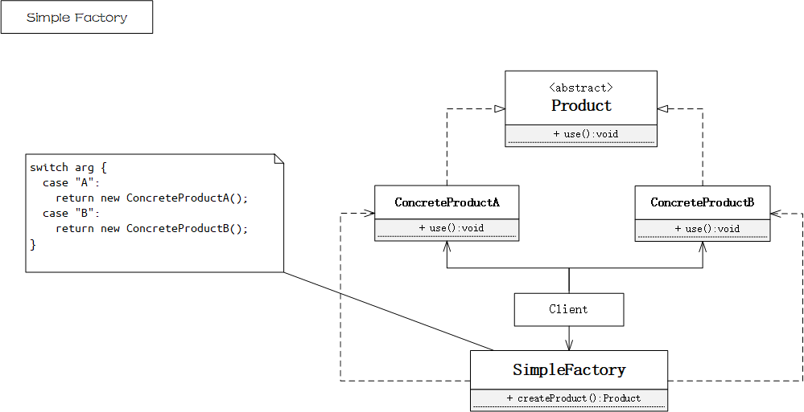
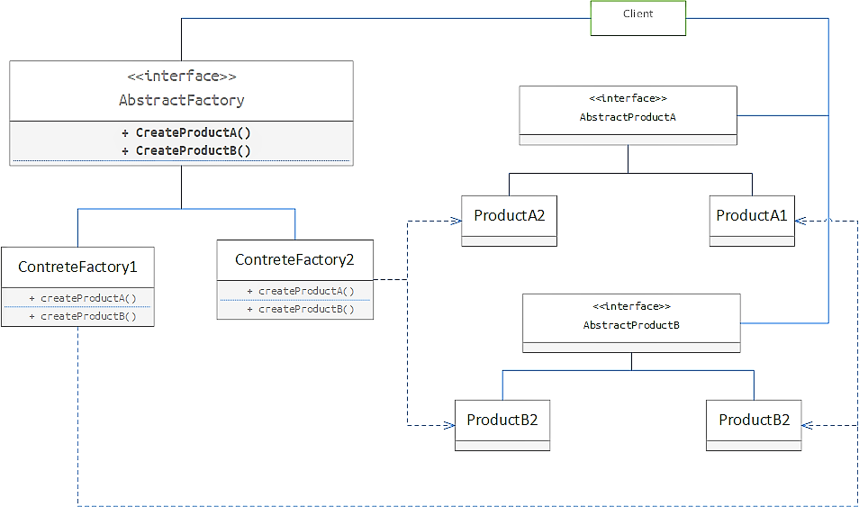
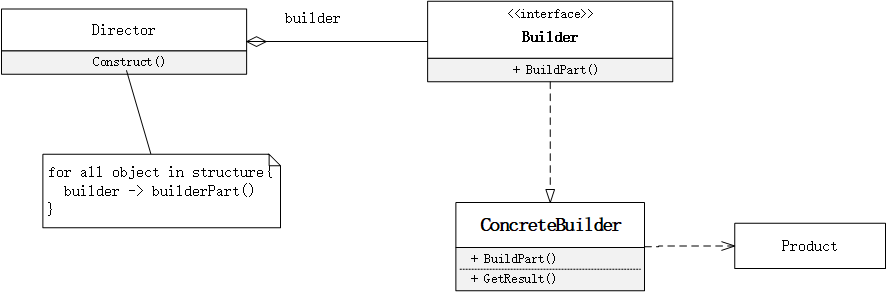
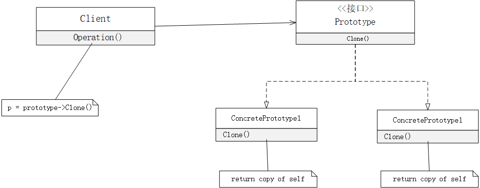
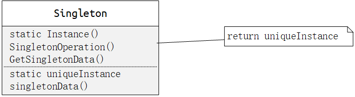
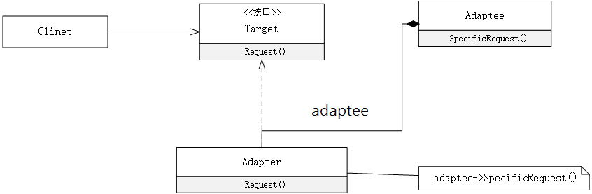
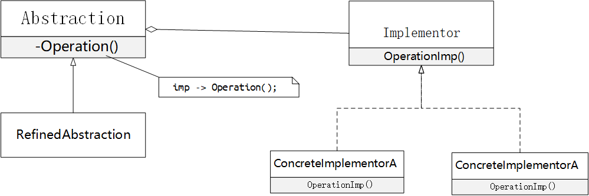
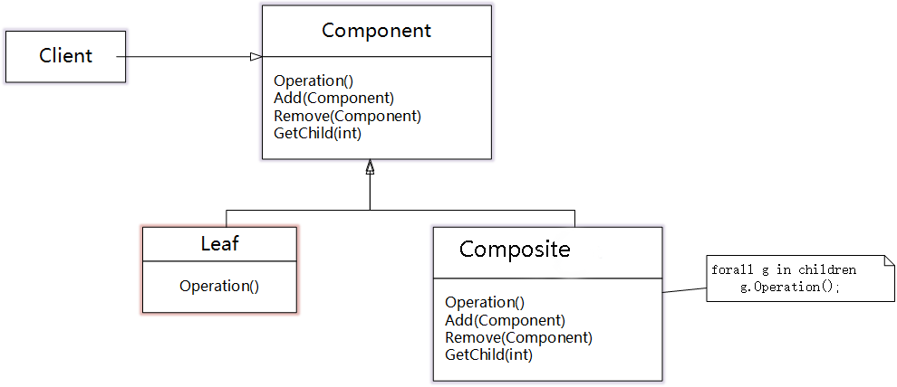

# Design Patterns

> 口号： **隔离变化，高内聚，低耦合**
>
> 目的：为了**重用代码**、让代码更容易被他人理解、保证代码可靠性


## 目录

### Creational

- [SimpleFactory](#SimpleFactory)
- [Factory Method](#FactoryMethod)
- [Abstract Factory](#AbstractFactory)
- [Builder](#Builder)
- [Prototype](#Prototype)
- [Singleton](#Singleton)


### Structural

+ [Adapter](#Adapter)

- [Bridge](#Bridge)
- [Composite](#Composite)
- [Decorator](#Decorator)
- [Facade](#Facade)
- [Flyweight](#Flyweight)
- [Proxy](#Proxy) 


### Behavioral

- [Chain Of Responsibil Ity](#ChainOfResponsibilIty)
- [Command](#Command)
- [Interpreter](#Interpreter)
- [Iterator](#Iterator)
- [Mediator](#Mediator)
- [Memento](#Memento)
- [Observer](#Observer)
- [State](#State)
- [Strategy](#Strategy)
- [Template Method](#TemplateMethod)
- [Visitor](#Visitor)


## 面向对象原则

1、**依赖倒置原则**（DIP）

+ 高度模块（稳定）不应该依赖于低层模块（变化），二者都应该依赖于抽象（稳定）
+ 抽象（稳定）不应该依赖于实现细节（变化），实现细节应该依赖于抽象（稳定）


2、**开放封闭原则**（OCP）

+ 对扩展开发，对更改关闭
+ 类模块应该是可扩展的，但是不可修改。


3、**单一职责原则**（SRP）

+ 一个类应该仅有一个引起它变化的原因
+ 变化的方向隐含着类的职责


4、**Liskov 替换原则**（LSP）

+ 子类必须能够替换它们的基类（IS-A）
+ 继承表达类型抽象


5、**接口隔离原则**（ISP）

+ 不应该强迫客户程序依赖它们不用的方法
+ 接口应该小而完善


6、**优先使用对象组合，而不是类继承**

+ 继承在某种程度上破环了封装性，子类父类耦合度高
+ 对象组合则只要求被组合的对象具有良好的接口，耦合度低


7、**封装变化点**

+ 使用封装来创建对象之间的分界线，让设计者可以在分界层的一侧进行修改，而对另一侧产生不良影响，


8、**针对接口编程，而不是针对实现编程**

+ 不降变量类声明为某个特定的具体类，而是声明为某个接口

+ 客户程序无需获得知对象的类型，只需要知道对象所具有的接口
+ 减少系统中各部分的依赖关系


# Creational design patterns

> 定义： 创建型模式**抽象了实例化过程**（绕开new），帮助系统独立于如何创建对象、组合和表示那些对象。
>
> 特征： 1）它们将关于该系统使用那些**具体的类的信息封装起来**
>
> ​		2）它们**隐藏了这些类的实例是如何被创建和放在一起的**。	


## SimpleFactory

### Ⅰ模式意图

- **在简单工厂模式中，可以根据参数的不同返回不同类的实例。**


### Ⅱ 模式适用

- 创建统一接口的对象


### Ⅲ 模式效果

- 简单工厂模式又称为静态工厂方法(Static Factory Method)模式，它属于类创建型模式。
- 简单工厂模式专门定义一个类来负责创建其他类的实例，被创建的实例通常都具有共同的父类。


### Ⅳ 模式结构

- `Factory`：工厂角色负责实现创建所有实例的内部逻辑
- `Product`：抽象产品角色是所创建的所有对象的父类，负责描述所有实例所共有的公共接口
- `ConcreteProduct`：具体产品角色是创建目标，所有创建的对象都充当这个角色的某个具体类的实例。




### Ⅴ模式实现


#### 参数化(c++)

```c++
// 抽象的产品(Product)接口
class Computer {
 public:
  virtual void use() = 0;
};
// 具体的产品(ConcreteProduct)
class AppleComputer : public Computer {
  virtual void use() { printf("use AppleComputer\n"; }
};

class IBMComputer : public Computer {
  virtual void use() { printf("use IBMComputer\n"; }
};
// 生产的类型
enum ComputerTypes {
  apple,
  ibm,
};

// 模式：SimpleFactory;
// 算法：——
// 复杂度：——
class ComputerFactory {
 public:
  static Computer* createComputer(ComputerTypes T) {
    Computer* computer = nullptr;
    switch (T) {
      case ComputerTypes::apple:
        computer = new AppleComputer();
        break;

      case ComputerTypes::ibm:
        computer = new IBMComputer();
        break;
    }
    return computer;
  }
};
```

测试

```c++
// Computer.test.cc
int main() {
  Computer* appleComputer = ComputerFactory::createComputer(ComputerTypes::apple);
  Computer* ibmComputer = ComputerFactory::createComputer(ComputerTypes::ibm);
  
  appleComputer->use();
  ibmComputer->use();
  
  return 0;
}
```

[查看更多](/src/DesignPattern/Creational/SimpleFactory)


## FactoryMethod

### Ⅰ模式意图

+ 定义一个用于创建对象的接口，让子类决定实例化哪一个类，factoryMethod使**一个类的实例化延迟到子类**。


### Ⅱ 模式适用

+ 当一个类不知道它所必须创建的对象的类的时候
+ 当一个类希望有它的子类来指定它所创建的对象的时候
+ 当类将创建对象的职责委托给多个帮助子类中的某一个，并且你希望将哪一个帮助子类是代理者这一信息局部化的时候


### Ⅲ 模式效果

+ Factory Method 模式解决**单个对象**的需求变化，缺点：**要求创建方法参数相同**
+ Factory Method 隔离类对象的使用者和具体类型之间的耦合关系，面对变化的具体类型，紧耦合关系（new）会让程序变脆弱。

+ 仅仅为了创建一个特定的ConcreteProduct对象，就不得不创建Creator的子类

+ 为子类提供挂钩

+ 连接平行的类层次


### Ⅳ 模式结构

+ `Product`：定义工厂方法所创建的对象的接口
+ `ConcreteProduct`： 实现Product的接口
+ `Creator`：工厂方法，返回一个Product类型的对象；可以调用工厂方法创建一个Product对象。
+ `ConcreteCreator`:  重定义工厂方法以返回一个ConcreteProduct实例。


### Ⅴ 模式实现

+ 两种不同的情况

  > 1、creator类是一个抽象类并且不提供它所声明的工厂方法的实现
  >
  > 2、creator是一个具体的类并且为工厂方法提供一个缺省的实现。

+ 参数化工厂方法

+ 特定语言的变化和问题

  > lazy initialization

+ 使用模板以避免创建子类


#### 标准版(c++)

```c++
// 行星抽象接口
class IPlanet {
 public:
  virtual void rotation() = 0;
  virtual ~IPlanet(){};
};

//工厂方法抽象接口
class ICreator {
 public:
  virtual IPlanet* createPlanet() = 0;
  virtual ~ICreator(){};
};
```

```c++
// 具体的产品：地球
class Earth : public IPlanet {
 public:
  virtual void rotation() { printf("Earth rotation\n"); }
};

// 具体的产品：火星
class Mars : public IPlanet {
 public:
  virtual void rotation() { printf("Mars rotation\n"); }
};

// 具体的工厂方法
class EarthCreator : public ICreator {
 public:
  virtual IPlanet* createPlanet() { return new Earth(); };
};

// 具体的工厂方法
class MarsCreator : public ICreator {
 public:
  virtual IPlanet* createPlanet() { return new Mars(); }
};
```

```c++
// 仅仅依赖抽象类型
void rotation(ICreator* creator) {
  IPlanet* planet = creator->createPlanet();
  planet->rotation();
  delete planet;
}

int main() {
  ICreator* creator1 = new EarthCreator();
  ICreator* creator2 = new MarsCreator();
  rotation(creator1);
  rotation(creator2);
  delete creator1;
  delete creator2;
}
```


[查看更多](/src/DesignPattern/Creational/FactoryMethod)


### Ⅵ 相关模式

+ abstract factory 经常用工厂方法来实现。

+ 工厂方法经常在Template Method中被调用
+ Prototypes不需要创建creator子类，但是通常需要一个针对Product类的Initialize操作
+ Creator使用Initialize来初始化对象，而factory method不需要这样的操作。


## AbstractFactory

### Ⅰ 模式意图

+ 提供一个创建一系列相关或互相依赖对象的接口，而无需指定它们的具体的类


### Ⅱ 模式适用

+ **一个系统要由多个产品系列中的一个来配置时**
+ 一个系统要独立于它的产品的创建、组合和表示时
+ 当你要强调**一系列相关的产品对象**的设计以便进行**联合**适用时
+ 当你提供一个产品类库，而只想显示它们的接口而不是实现时


### Ⅲ 模式效果

+ 它分离了具体的类
+ 它使得易于交换产品系列
+ 它有利于产品的一致性，**保证产品的相关性**
+ **难以支持新种类的产品**


### Ⅳ 模式结构

+ `AbstractFactory`: 创建抽象产品的操作接口
+ `ConcreteFactory`: 实现具体产品对象的操作
+ `AbstractProduct`: 一类产品对象的接口
+ `ConcreteProduct`: 定义一个将被相应的具体工厂创建的产品对象
+ `Client`:  仅使用由**`AbstractFactory`**和**`AbstractProduct`**类声明的接口





### Ⅴ 模式实现

+ 1、工厂作为单件

  > 一个应用中一般每个产品系列只需一个ConcreteFactory的实例，因此工厂通常最好实现为一个Singleton

+ 2、创建产品

  > \+ abstractfactory仅申明一个创建产品的接口，真正创建产品是由ConcreteProduct子类实现的，最通常的一个方法是为每个产品定义一个工厂方法。
  >
  > \+ 如果有多个可能的产品系列，具体的工厂也可以使用Prototype模式来实现

+ 定义可扩展的工厂

  > \+ 参数化


#### 标准版(c++)

```c++
// 按钮接口
class Button {
 public:
  virtual void drawButton() = 0;
  virtual ~Button(){};
};

// 菜单接口
class Menu {
 public:
  virtual void drawMenu() = 0;
  virtual ~Menu(){};
};

// 抽象工厂接口
class Factory {
 public:
  virtual Button *createButton() = 0;
  virtual Menu *createMenu() = 0;
  virtual ~Factory(){};
};
```

```c++
// 具体的产品系列 linux
class LinuxButton : public Button {
 public:
  virtual void drawButton() { printf("LinuxButton\n"; }
};

class LinuxMenu : public Menu {
 public:
  virtual void drawMenu() { printf("LinuxMenu"); }
};

// 具体的产品系列 windows
class WindowsButton : public Button {
 public:
  virtual void drawButton() { printf("WindowsButton\n"); }
};

class WindowsMenu : public Menu {
 public:
  virtual void drawMenu() { printf("WindowsMenu"); }
};
```

```c++
// 具体的工厂1
class LinuxFactory : public Factory {
 public:
  Button *createButton() { return new LinuxButton(); }
  Menu *createMenu() { return new LinuxMenu(); }
};

// 具体的工厂2
class WindowsFactory : public Factory {
 public:
  Button *createButton() { return new WindowsButton(); }
  Menu *createMenu() { return new WindowsMenu(); }
};
```

```c++

// Client仅使用由 AbstractFactory 和 AbstractProduct类声明的接口
void Client(Factory* f) {
  Button* button = f->createButton();
  Menu* menu = f->createMenu();

  button->drawButton();
  menu->drawMenu();
}

int main() {
  Factory* linuxFactory = new LinuxFactory();
  Client(linuxFactory);
  return 0;
}
```


#### 单件+参数化(typeScript)

```typescript
// 人接口
export interface IPeople {
    yingyingying(): void;
}
// 衣服接口
export interface IClothes {
    beWearing(): void;
}
// 类型
export enum HumanTypes {
    Man,
    Woman,
}
// 抽象工厂
export interface HumanFactory {
    createPeople(HumanTypes): IPeople;
    createClothes(HumanTypes):IClothes;
}
```

```typescript
// 具体people
class Man implements IPeople {
    public yingyingying() {
        console.log("man is yingyingying")
    }
}
class Woman implements IPeople {
    public yingyingying() {
        console.log("Woman is yingyingying")
    }
}

// 具体clothes
class WomanClothing implements IClothes {
    public beWearing() {
        console.log("WomanClothing is beWearing")
    }
}
class ManClothing implements IClothes {
    public beWearing() {
        console.log("ManClothing is beWearing")
    }
}
```

```typescript
// 设计模式：创建型——抽象工厂（参数化 + 单件）
export class StandardHumanFactory implements HumanFactory {
    protected constructor() { }
    public createPeople(t: HumanTypes): IPeople {
        switch (t) {
            case HumanTypes.Man:
                return new Man();
            case HumanTypes.Woman:
                return new Woman();
        }
        return null;
    }
    public createClothes(t: HumanTypes): IClothes {
        switch (t) {
            case HumanTypes.Woman:
                return new WomanClothing();
            case HumanTypes.Man:
                return new ManClothing();
        }
        return null;
    }
    private static _instance: StandardHumanFactory = null;
    public static Instance(): StandardHumanFactory {
        if (this._instance == null) {
            this._instance = new StandardHumanFactory();
        }
        return this._instance;
    }
}

```

```typescript
// 描述：仅使用由 AbstractFactory 和 AbstractProduct类声明的接口
function Client(f: HumanFactory,t:HumanTypes) {
    f.createClothes(t).beWearing();
    f.createPeople(t).yingyingying();
}

function main() {
    Client(StandardHumanFactory.Instance(),HumanTypes.Man);
    Client(StandardHumanFactory.Instance(),HumanTypes.Woman);
}
```


[更多代码](/src/DesignPattern/Creational/AbstractFactory)


### Ⅵ 相关模式

+ `AbstractFactory`类通常常用工厂方法实现，但它们也可以用`Prototype`实现


## Builder

### Ⅰ 模式意图

+ 将一个复杂对象的**构建与它的表示分离**，使得**同样的构建过程可以创建不同的表示**。


### Ⅱ 模式适用

+ 当创建复杂对象的算法应该**独立于该对象的组成部分**以及的装配方式时
+ 当构建过程必须允许被构造的对象有不同的表示时。


### Ⅲ 模式效果

+ 它使你可以改变一个产品的内部表示，需要**改变时只需要一个新的生成器**
+ 它将构造代码和表示代码分离
+ 它是你可对构造过程进行更精细的控制


### Ⅳ 模式结构

+ `Builder`: 为创建一个Product对象的各个部件指定抽象接口

+ `ConcreteBuilder`: 实现Builder的接口以构造和装配该产品的各个部件，提供一个检索产品的接口。

+ `Director`: 构建一个使用Builder接口的对象

+ `Product`: 表示被构造的复杂对象





### Ⅴ 模式实现

+ 装配和构造函数

  > 生成器逐步的构造它们的产品。因此builder类接口必须足够普遍，以便为各种类型的具体生成器构造产品。

+ **产品没有抽象类**
+ 在builder中缺省的方法为空。


#### 标准版(c++)

```c++
/* "Product" */
class Pizza {
 public:
  string dough = "";
  string sauce = "";
  string topping = "";
};
```

```c++
/* "Abstract Builder" */
class PizzaBuilder {
 protected:
  Pizza* pizza;

 public:
  // 返回对象
  Pizza* getResult() { return pizza; }
  // 创建对象
  void createNewPizzaProduct() { pizza = new Pizza(); }

  virtual void buildDough() = 0;
  virtual void buildSauce() = 0;
  virtual void buildTopping() = 0;
  virtual ~PizzaBuilder(){};
};
```


```c++
/* "ConcreteBuilder" */
class HawaiianPizzaBuilder : public PizzaBuilder {
 public:
  void buildDough() { pizza->dough = "cross"; }
  void buildSauce() { pizza->sauce = "mild"; }
  void buildTopping() { pizza->topping = "ham+pineapple"; }
};

class SpicyPizzaBuilder : public PizzaBuilder {
 public:
  void buildDough() { pizza->dough = "pan baked"; }
  void buildSauce() { pizza->sauce = "hot"; }
  void buildTopping() { pizza->topping = "pepperoni+salami"; }
};

```


```c++
/* "Director" */
class Director {
 private:
  PizzaBuilder* pizzaBuilder;

 public:
  void setPizzaBuilder(PizzaBuilder* pb) { pizzaBuilder = pb; }

  Pizza* getPizza() { return pizzaBuilder->getResult(); }

  void constructPizza() {
    pizzaBuilder->createNewPizzaProduct();
    pizzaBuilder->buildDough();
    pizzaBuilder->buildSauce();
    pizzaBuilder->buildTopping();
  }
```


```c++
int main() {
  // 1、创建Director对象
  Director waiter;

  // 2、创建具体的builder
  PizzaBuilder* hawaiianPizzabuilder = new HawaiianPizzaBuilder();
  PizzaBuilder* spicyPizzaBuilder = new SpicyPizzaBuilder();

  // 3、生成pizza对象
  waiter.setPizzaBuilder(hawaiianPizzabuilder);
  waiter.constructPizza();
  Pizza* pizza = waiter.getPizza();

  cout << pizza->dough << pizza->sauce << pizza->topping << endl;

  //清理内存
  delete hawaiianPizzabuilder;
  delete spicyPizzaBuilder;
  delete pizza;
}
```


[更多代码](/src/DesignPattern/Creational/Builder)

### Ⅵ 相关模式

+ 与 `Abstract Factory`目的相同，用于创建复杂对象

+ `Builder`模式着重构造**一个复杂对象**；`Abstract Factory`模式着重于创建**多个系列的产品对象**.

+ `Builder`模式着重于**一步步**构建对象，并在**最后一步返回**；`Abstract Factory`模式里对象是**立即返回**的。

  


## Prototype

### Ⅰ 模式意图

+ 用原型实例指定创建对象的种类，并且通过拷贝这些原型创建新的对象。


### 2) 模式适用

+ 当要实例化的类是在运行时刻指定时，例如，通过动态加载。
+ 为了**避免创建一个与产品类层次平行的工厂类层**次时。

+ 当一个类的实例只能有几个不同状态组合中的一种时。创建相应数目的原型并克隆它们可能比每次用合适的状态手工实例化该类更方便一些。


### 3) 模式效果

+ 它对客户隐藏了具体的产品类，因此减少了客户知道的名字的数量。
+ 使客户无需改变即可使用与特定应用相关的类
+ 运行时刻增加和删除产品
+ 改变值以指定新对象
+ 改变结构以指定新对象
+ 减少子类的构造
+ 用类动态配置应用


### Ⅳ 模式结构

+ `Prototype`: 声明一个克隆自身的接口
+ `ConcretePrototype`: 实现一个克隆自身的操作
+  `Client`: 让一个原型克隆自身从而创建一个新的对象





### Ⅴ 模式实现

+ 使用一个原型管理器
+ 实现克隆操作
+ 初始化克隆对象


#### 标准版

```c++
// Prototype 接口
class IImage {
 public:
  IImage() {}
  virtual int getData() = 0;
  virtual ~IImage() {}
  virtual IImage* Clone() = 0;
};
```

```c++
// 具体的原型类
class ConcreteImage : public IImage {
 private:
  int data;

 public:
  ConcreteImage(int data) { 
      this->data = data; 
  }
  // 拷贝构造函数,进行数据复制
  ConcreteImage(const ConcreteImage& p) { 
      this->data = p.data; 
  }
  virtual int getData() { 
      return this->data; 
  }
  virtual IImage* Clone() { 
      return new ConcreteImage(*this); 
  }
};
```

```c++
int main() {
  IImage* img = new ConcreteImage(17);
  IImage* imgClone = img->Clone();

  printf("%d\n", img->getData());
  printf("%d\n", imgClone->getData());
  return 0;
}
```


[更多代码](/src/DesignPattern/Creational/Prototype)


### 6) 相关模式

+ Prototype和Abstract Factory模式在某种方面是相互竞争
+ Abstract Factoryk可以储存一个被克隆的原型的集合，并且返回产品对象
+ 大量使用Composite和Decorator模式的设计通常也可从Prototype模式处获益。


## Singleton

### Ⅰ 模式意图

+ 保证一个类仅有一个实例，并提供一个访问它的全局访问点。


### Ⅱ 模式适用

+ 当类只能有一个实例而且客户可以从一个众所周知的访问点访问它时。
+ 当这个唯一实例应该是通过子类化可扩展的，并且客户应该无需更改代码就能使用一个扩展的实例时。


### Ⅲ 模式效果

+ 对唯一实例的受控访问
+ 缩小命名空间
+ 允许对操作和表示的精化
+ 允许可变数目的实例
+ 比类操作更灵活


### Ⅳ 模式结构

+ `Singleton`: 定义一个Instance操作，允许客户访问它的唯一实例。

  




### Ⅴ 模式实现

+ 保证一个唯一的实例

+ 创建Singleton类的子类

  > \+ 单件注册表


#### 懒汉式-线程不安全(c++)

```c++
class Singleton {
 private:
  Singleton(){};
  Singleton(const Singleton& other);

  static Singleton* uniqueInstance;
  char _data[4] = {'x', 'x', 'x', '\0'};

 public:
  char* data() { return _data; };
  // 线程不安全的单例模式
  static Singleton* Instance() {
    if (uniqueInstance == nullptr) {
      uniqueInstance = new Singleton();
    }
    return uniqueInstance;
  }
};

Singleton* Singleton::uniqueInstance = nullptr;
```

```c++
int main(）{
  Singleton* sing = Singleton::Instance();
  printf("%s", sing->data();
  return 0;
}
```

[更多代码](/src/DesignPattern/Creational/Singleton)


### Ⅵ 相关模式

+ 很多模式可以使用Singleton模式实现，Abstract Factory，Builder、Prototype。


# Structural design patterns

> 定义：结构型模式涉及到如何组合类和对象以获得更大的结构。结构型模式不是对接口和实现进行组合，而是描述了如何对一些对象进行组合，从而实现新功能的一种方法。


## Adapter

### Ⅰ 模式意图

+ 将一个类的接口转换成客户希望的另一个接口，Adapter模式使得原本由于接口不兼容而不能一起工作的那些类可以一起工作 。


### Ⅱ 模式适用

+ 你想使用一个已经存在的类，而它的接口不符合你的需求。
+ 你想创建一个可以复用的类，该类可以与其它不相关的类或不可预见的类协同工作。


### Ⅲ 模式效果

+ 允许一个adapter与多个adaptee，即adaptee本身以及它的所有子类、组合类同时工作。
+ 使得重定义adapter的行为比较困难。


### Ⅳ 模式结构

+ `Target` 定义Client使用的与特定领域相关的接口。
+ `Clinet` 与符合Target接口的对象协同。
+ `Adaptee` 定义一个已经存在的接口，这个接口需要适配。
+ `Adapter` 对Adaptee的接口与Target接口进行适配





### Ⅴ 模式实现

```c++
// 转换的目标接口
class ITarget {
 public:
  virtual int request() = 0;
  virtual ~ITarget(){};
};
```

```c++
// 需要转换的对象类接口
class IAdaptee {
 public:
  virtual int SpecificRequest() = 0;
  virtual ~IAdaptee(){};
};
```

```c++
// 需要转换的具体类
class Asaptee : public IAdaptee {
 private:
  int data = 12;

 public:
  virtual int SpecificRequest() { 
      return this->data; 
  }
};
```

```c++
// 进行转换的适配器
class Adapter : public ITarget {
 private:
  IAdaptee* pAdaptee;
    
 public:
  Adapter(IAdaptee* adaptee) { 
      this->pAdaptee = adaptee; 
  }
  virtual int request() { 
      return pAdaptee->SpecificRequest() + 100; 
  }
};
```


### Ⅵ 相关模式

+ Bridge目的是将接口部分和实现分离，从而对它们可以较为简单相对独立的加以变化。而Adapter则改变一个已有对象的接口。
+ Decorator 支持递归组合，增强了其它对象的功能而同时又不改变它的接口。
+ Proxy 在不改变它的接口的条件下，为另一个对象定义了一个代理。


## Bridge

### Ⅰ模式意图

+ 将抽象部分与它的实现部分分离，使他们都可以独立地变化。
+ 摆脱继承机制的不灵活，对不同维度的部分进行独立的修改、扩充和重用。


### Ⅱ 模式适用

+ 你不希望在抽象和它的实现部分之间有一个固定的绑定关系。
+ 类的抽象以及它的实现都应该可以通过生成子类的方法加以扩充。
+ 对一个抽象的实现部分的修改应对客户不产生影响。
+ 你想在多个对象间共享实现，但同时要求客户并不知道这一点。


### Ⅲ 模式效果

+ 分离接口及其实现部分
+ 提高可扩充性
+ 实现细节对客户的透明


### Ⅳ 模式结构

+ `Abstraction` 定义抽象类的接口；维护一个指向Implementor类型对象的指针
+ `RefinedAbstraction` 扩充由Abstraction定义的接口
+ `Implementor` 定义实现类的接口，并不一定要与Abstraction接口一致
+ `ConcreteImplementor` 实现Implementor接口并定义它的具体实现





### Ⅴ 模式实现

#### 仅有一个Implementor(cc)

当仅有一个实现时，没有必要创建一个抽象的Implementor类；

```c++
// 抽象类
class Abstraction {
 protected:
  // 维护一个指向Implementor类型对象的指针
  Implementor* implementor;

 public:
  virtual int OperatorA() = 0;
  virtual int OperatorB() = 0;
  virtual ~Abstraction(){};
};
```

```c++
// 实现Implementor接口并定义它的具体实现
// 当仅有一个实现时，没有必要创建一个抽象的Implementor类；
class Implementor {
 public:
  int getColor() { return 0x12; }
  int getShap() { return 0x14; }
};
```

```c++
// 扩充由Abstraction定义的接口
class RefinedAbstraction : public Abstraction {
 public:
  RefinedAbstraction(Implementor* implementor) {
    this->implementor = implementor;
  }
  virtual int OperatorA() {
    int color = implementor->getColor();
    return color;
  }
  virtual int OperatorB() {
    int shap = implementor->getShap();
    return shap;
  }
  ~RefinedAbstraction() {
    if (implementor != nullptr) {
      delete implementor;
    }
  }
};
```

```c++
// 利用简单工厂创建
class AbstractionFactory {
 public:
  static Abstraction* createAbstraction() {
    return new RefinedAbstraction(new Implementor());
  }
};

int main() {
  Abstraction* Abstraction = AbstractionFactory::createAbstraction();
  printf("%d\n", Abstraction->OperatorA());
  printf("%d\n", Abstraction->OperatorB());
  return 0;
}
```


#### 创建正确Implementor(ts)

```typescript
interface Implementor {
    basePrice(): number
    name(): string
}

abstract class Abstraction {
    protected impl: Implementor;
    abstract getStd(): string;
    abstract getPro(): string;
}

class RefinedAbstraction extends Abstraction {
    constructor(implementor: Implementor) {
        super()
        this.impl = implementor;
    }
    public getStd(): string {
        return `${this.impl.name()} std: ${this.impl.basePrice() * 5}`
    }
    public getPro(): string {
        return `${this.impl.name()} pro: ${this.impl.basePrice() * 10}`
    }
}

// 具体的实现类
class ConcreteImplementorWin implements Implementor {
    public basePrice(): number {
        return 10
    }

    public name(): string {
        return "win"
    }
}

class ConcreteImplementorLinux implements Implementor {
    public basePrice(): number {
        return 5
    }

    public name(): string {
        return "Linux"
    }
}

export function NewBridgeLinux():Abstraction{
    return new RefinedAbstraction(new ConcreteImplementorLinux());
}

export function NewBridgeWin():Abstraction{
    return new RefinedAbstraction(new ConcreteImplementorWin());
}
```

[更多代码](/src/DesignPattern/Structural/Component/)

### Ⅵ 模式相关

+ `Abstract Factory` 模式可以用来创建和配置一个特定的`Bridge`模式。
+ `Adapter` 模式用来帮助无关的类协调工作，它通常在系统设计完成后才被使用。然而`Bridge`模式则是在系统开始时就被使用，它使得抽象接口和实现部分可以独立的改变。


## Composite

### Ⅰ模式意图

+ 将对象组合成树形结构以表示“部分-整体”的层次结构。`Conposite`使得用户对单个对象和组合对象的使用具有一致性。
+ `Conposite` 模式的关键是一个抽象类，它既可以表示图元，又可以代表图元的容器。


### Ⅱ 模式适用

+ 你想表示对象的部分—整体层次结构。
+ 你希望用户忽略组合对象与单个对象的不同，用户将统一地使用组合结构中的所有对象。


### Ⅲ 模式效果

+ 定义了包含基本对象和组合对象的类层次结构。
+ 简化客户代码
+ 使得更容易增加新类型的组件
+ 使你的设计变得更加一般化


### Ⅳ 模式结构

+ `Component` 为组合的对象声明接口，在适合的情况下，实现所有类共有接口的省却行为，声明一个接口用于访问和管理Component的子组件，（回溯访问父组件）
+ `Leaf` 在组合中表示叶节点对象，叶节点没有子节点；在组合中定义图元对象的行为；
+ `Composite` 定义有子部分的那些部分的行为；储存子部分；在Component接口中实现与子部分有关的操作；
+ `Client` 通过Component接口操作组合部分的对象





### Ⅴ 模式实现

+ 显示的父部件引用
+ 共享组件
+ 最大化Component接口
+ 声明管理子部分的操作

+ Component是否应该实现一个Component列表
+ 子部分排序
+ 使用高速缓冲存贮改善性能
+ 应该由谁删除Component
+ 存贮组件最好用哪一种数据结构（数据结构的选择取决于效率）


```typescript
export abstract class Component {
    protected data: number;
    abstract Print();
    abstract Increase();
    abstract Add(compl:Component);
}

export class Composite extends Component {
    private Components: Array<Component>;
    constructor(n: number) {
        super()
        this.data = n;
        this.Components = new Array<Component>();
    }
    public Add(compl:Component){
        this.Components.push(compl);
    }
    public Print() {
        console.log("Composite %d",this.data);
        for (const iterator of this.Components) {
            iterator.Print();
        }
    }
    public Increase() {
        this.data++;
        for (const iterator of this.Components) {
            iterator.Increase();
        }
    }
}

export class Leaf extends Component{
    constructor(n:number){
        super()
        this.data = n;
    }
    public Add(compl:Component){
        throw "叶子类无法添加子类";
    }
    public Increase(){
        this.data++;
    }
    public Print(){
        console.log("Leaf %d",this.data);
    }
}
```

```typescript
const root: Component = new Composite(0);
root.Add(new Leaf(1))
root.Add(new Leaf(2))
let compl = () => {
    let p = new Composite(12);
    p.Add(new Leaf(19));
    p.Add(new Leaf(67));
    return p;
}
root.Add(compl());

root.Print();
root.Increase();
root.Print();
```


### Ⅵ 模式相关

+ 通常部件——父部件连接用于Responsibility of Chain模式

+ Decorator 模式经常与Composite模式一起使用。当装饰和组合一起使用时，它们通常有一个公共的父类。因此装饰必须支持具有Add、Remove和GetChild操作的Component接口
+ Flyweight让你共享组件，但不能引用他们的父部件
+ Itertor可用于遍历Composite
+ Visitor将本来应该分布在Composite和Leaf类中的操作和行为局部化；


## Decorator

