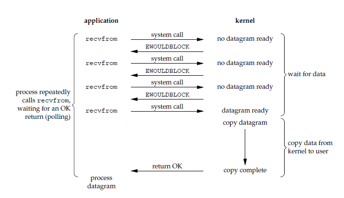

# IO 模型

## Block I/O

> **阻塞I/O模型**，在系统调用结果返回之前，当前线程会被挂起，处于不可中断的挂起状态。直到操作系统通知完成，才继续执行。


### Block tcpServer

+ 产生阻塞的系统调用 `accept()` `recv()` 

```c
SOCKET createTcpSocket() {
  SOCKET result = socket(AF_INET, SOCK_STREAM, IPPROTO_TCP);
  return result;
}

struct sockaddr_in createSocketConfig(u_short hostshort) {
  struct sockaddr_in result;
  result.sin_family = AF_INET;
  result.sin_port = htons(hostshort);
  result.sin_addr.S_un.S_addr = INADDR_ANY;
  return result;
}


void handleLoop(SOCKET aSocket) {

  char* buffer = malloc(sizeof(char) * BUFFER_SIZE);
  memset(buffer, 0, BUFFER_SIZE);
  while (TRUE) {
    printf("******** sys recv() ********\n");
    // 阻塞的系统调用，调用不返回时线程被挂起。
    int ret = recv(aSocket, buffer, 255, 0);
    
    if (ret > 0) {
      buffer[ret] = 0x00;
      printf("%s\n", buffer);
    }
    if (ret == 0) {
        closesocket(aSocket);
        break;
    }
  }
  free(buffer);
}

int main() {
  // win下设置dll版本
  WSADATA wsaData;
  WSAStartup(MAKEWORD(2, 2), &wsaData);

  // 创建服务器 主socket
  SOCKET server = createTcpSocket();
  SOCKADDR_IN serverAddr = createSocketConfig(3000);

  // 绑定端口
  bind(server, (PSOCKADDR)&serverAddr, sizeof(serverAddr));

  // 系统调用函数 listen(), 
  //1. 将一个未连接的套接字转换为被动套接字，指示内核应该接收指向该套接字的连接请求。
  //2. 指定内核应该为相应的套接字队列的最大连接个数。
  listen(server, 1);

  while (TRUE) {
    // 用于储存客户端socket地址
    struct sockaddr_in clientAddrBuffer;
    int addr_len = sizeof(clientAddrBuffer);

    // systemCall: accept()
    // 用于内核返回下一个已完成连接。如果已完成连接队列为空，则阻塞线程处于挂起状态。
    printf("******* sys accept() ********\n");
    SOCKET clientSocket = accept(server, (PSOCKADDR)&clientAddrBuffer, &addr_len);
    
    handleLoop(clientSocket);
  }

  closesocket(server);
  WSACleanup();
  return 0;
}
```


## NonBlock I/O

> 应用进程执行系统调用之后，内核返回一个错误码。应用进程可以继续执行，但是需要不断的执行系统调用来获知 I/O 是否完成，这种方式称为轮询（polling）
>
> 由于 CPU 要处理更多的系统调用，因此这种模型的 CPU 利用率比较低，**但是线程不会长时间挂起，可以在等待的同时处理其它的事件**。



### NonBlock tcpServer

+ 重点轮询操作

```c++
class Server {
 private:
  typedef DWORD (*pFunc)(PVOID);

  WSADATA wsaData;
  SOCKET serverSocket;
  SOCKADDR_IN serverAddr;
  pFunc handleFunc;
  int iMode;

  SOCKADDR_IN createSocketConfig(u_short port) {
    SOCKADDR_IN result;
    result.sin_family = AF_INET;
    result.sin_port = htons(port);
    result.sin_addr.S_un.S_addr = INADDR_ANY;
    return result;
  }

  SOCKET createTcpSocket() { 
      return socket(AF_INET, SOCK_STREAM, IPPROTO_TCP); 
  }

  // 接受连接的循环
  void acceptLoop() {
    while (true) {
      struct sockaddr_in clientAddrBuffer;
      int addr_len = sizeof(clientAddrBuffer);

      // systemCall: accept()
      // 用于内核返回下一个已完成连接。如果已完成连接队列为空，则阻塞线程处于挂起状态。
      SOCKET clientSocket =
          accept(serverSocket, (PSOCKADDR)&clientAddrBuffer, &addr_len);
      printf("******* accept polling ********\n");

      // 轮询
      if (clientSocket == INVALID_SOCKET) {
        //表示没有客户端发起连接，继续循环
        if (WSAGetLastError() == WSAEWOULDBLOCK) {
          Sleep(1000);
          continue;
        } else {
          printf("accept failed!\n");
        }
      }

      handleFunc((PVOID)clientSocket);
    }
  }
  // 设置网络io为非阻塞模式
  void setIoNonBlock() {
    this->iMode = 1;
    ioctlsocket(serverSocket, FIONBIO, (u_long FAR*)&iMode);
  }

 public:
  Server() {
    printf("wsaStartup ...\n");
    WSAStartup(MAKEWORD(2, 2), &(this->wsaData));
    printf("create main socket\n");
    this->serverSocket = createTcpSocket();
  }

  void setHandleFunc(pFunc aHandleFunc) { this->handleFunc = aHandleFunc; }

  void bindAndListen(u_short port) {
    this->serverAddr = createSocketConfig(port);
    bind(serverSocket, (PSOCKADDR)&serverAddr, sizeof(serverAddr));
    listen(serverSocket, 1);
    this->setIoNonBlock();
    this->acceptLoop();
  }

  ~Server() {
    closesocket(serverSocket);
    WSACleanup();
  }
};
```

```c++
char* createBuffer(int len) {
  char* result = new char[len];
  memset(result, 0, len);
  return result;
}

void fillStringEnd(char* str, int index) { str[index] = 0x00; }

DWORD handleFunc(PVOID pSocket) {
  SOCKET aSocket = (SOCKET)pSocket;

  char* buffer = createBuffer(1024);

  while (TRUE) {
    int ret = recv(aSocket, buffer, 255, 0);
    printf("******** recv polling ********\n");

    if (ret == SOCKET_ERROR) {
      int errcode = WSAGetLastError();
      if (errcode == WSAEWOULDBLOCK) {
        Sleep(100);
        continue;
      } else {
        printf("xxxxx recv error xxxxxxx\n");
        return -1;
      }
    }
	if (ret > 0) {
      fillStringEnd(buffer, ret);
      printf("%s\n", buffer);
    } 
    else if (ret == 0) {
      printf("client socket closed\n");
      break;
    } 
  }

  delete[] buffer;
  closesocket(aSocket);
  return 0;
}

int main() {
  Server server;
  server.setHandleFunc(handleFunc);
  server.bindAndListen(3000);
}
```


## Multiplexing I/O

> **它可以让单个进程具有处理多个 I/O 事件的能力。又被称为 Event Driven I/O，即事件驱动 I/O**。
>
> 使用 select 或者 poll 等待数据，并且可以等待多个套接字中的任何一个变为可读。这一过程会被阻塞，当某一个套接字可读时返回，之后再使用 recvfrom 把数据从内核复制到进程中。
>
> 如果一个 Web 服务器没有 I/O 复用，那么每一个 Socket 连接都需要创建一个线程去处理。如果同时有几万个连接，那么就需要创建相同数量的线程。相比于多进程和多线程技术，I/O 复用不需要进程线程创建和切换的开销，但是涉及两个系统调用，有部分性能开销。


### Multiplexing tcpServer

