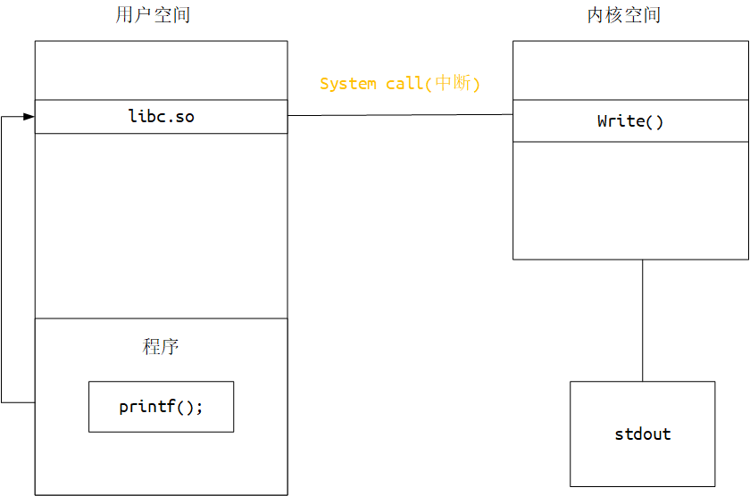
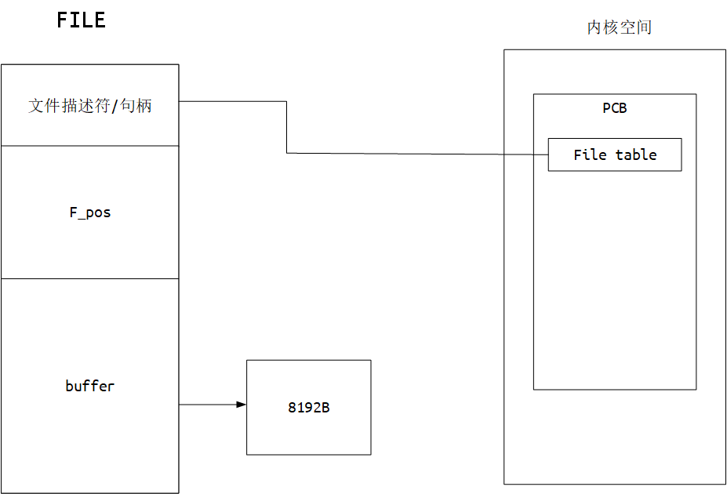

# Kernel

## Index

### bootloder

+ [BIOS]()
+ [EFI]()

### API

+ [std function](#StdFunction)

+ [sys function]()

### File descriptor

## API

### StdFunction

> 语言的标准函数，用于不同系统的跨平台。

标准函数例如c标准：`fopen()` `printf()` 

标注函数库(编译时链接)：`libc` `glibc` `mscrt`

#### 调用关系

#### 实现区别

标准函数带有其它操作，如io函数带有缓冲区，而系统函数比较存粹。

只有在缓冲区满，或者手动调用刷新时，标准函数会将内容一次写入内核空间。

