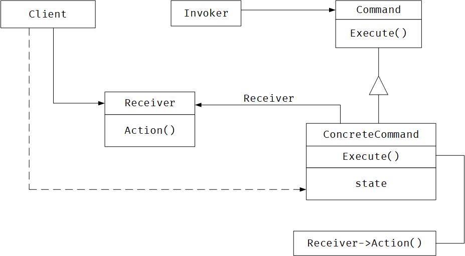
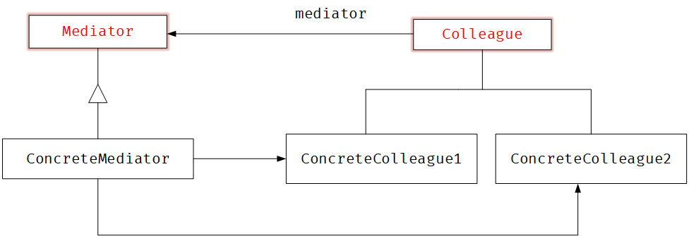
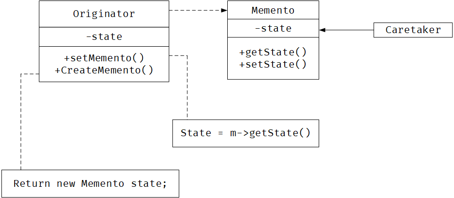

# Behavioral

> 行为模式涉及到算法和对象间职责的分配。行为模式不仅描述对象或类的模式，还描述它们之间的通信模式。
>
> 这些模式刻画了运行时难以追踪的复杂的控制流。它们将你的注意力从控制流转移到对象间的联系方式上来。


<br/>

## Chain Of Responsible Ity

### Ⅰ 模式意图

+ 使多个对象都有机会处理请求，从而避免请求的发送者和接收者之间的耦合关系。将这些对象连接成一条链，并沿着这条链传递请求，直到有一个对象处理为止。


### Ⅱ 模式适用

+ 有多个的对象可以处理一个请求，哪个对象处理该请求运行时刻自动确定
+ 你想在不明确指定接收者的情况下，向多个对象中的一个提交一个请求
+ 可处理一个请求的对象集合应被动态指定。


### Ⅲ 模式效果

+ 降低耦合度
+ 增加了给对象指派职责的灵活性
+ 不保证被接受


### Ⅳ 模式结构

+ `Handler` 定义一个处理请求的接口
+ `ConcreteHandler` 处理它所负责的请求；可访问它的后继者
+ `Client` 向链上的具体处理者体提交请求


> + 当客户提交一个请求时，请求沿链传递至有一个ConcreteHandle对象负责处理它。

### Ⅴ 模式实现

```

```


### Ⅵ 相关模式

+ `Composite` 责任链常与Composite一起使用。这种情况下，一个构件的父构件可作为它的后继者


<br/>

## Command

### Ⅰ 模式意图

+ 将一个请求封装为一个对象，从而使你可用不同的请求对客户进行参数化；对请求排队或记录请求日志，以及支持可撤销操作


### Ⅱ 模式适用

+ 抽象出待执行的动作以参数化某对象。（回调函数的一个面向对象的替代品）
+ 在不同的时刻指定、排列和执行请求
+ 支持修改日志，取消操作
+ 用构建在原语操作上的高层操作一个系统


### Ⅲ 模式效果

+ Command模式将调用操作的对象与知道如何实现该操作的对象解耦
+ Command是头等的对象，可以被操作和扩展
+ 你可以将多个命令装配成一个复合命令


### Ⅳ 模式结构

+ `Command` 声明执行操作的接口
+ `ConcreteCommand` 将一个接收者对象绑定于一个动作；调用接收者相应的操作
+ `Client` 创建一个具体命令对象并设定它的接收者
+ `Invoker` 要求该命令执行这个请求
+ `Receiver` 知道如何实施与执行一个请求相关的操作。任何类都可能作为一个接收者





> + Client 创建一个ConcreteCommand对象并指向它的Receiver
> + 某Invoker对象储存该ConcreteCommand对象


### Ⅴ 模式实现

```

```


### Ⅵ 相关模式

+ `Composite` 可用来实现宏命令
+ `Memento` 可用来保持某个状态，命令用这一状态来取消它的效果。


<br/>

## Interpreter

### Ⅰ 模式意图

+ 给定一个语言，定义它的文法的一种表示。并定义一个解释器，这个解释器使用该表示来解释语句中的句子


### Ⅱ 模式适用

+ 文法简单

+ 效率不是一个关键问题，（高效的解释器不是通过直接解释语法分析树实现的）

  

### Ⅲ 模式效果

+ 易于改变和扩展文法
+ 也易于实现文法
+ 复杂的文法难以维护


### Ⅳ 模式结构

+ `AbstractExpression` 声明一个抽象的解释操作，这个接口为抽象语法树中所有的节点所共享
+ `TerminalExpression` 实现与文法中的终结符相关联的解释操作
+ `NoterminalExpression` 非终结表达式
+ `Context` 包含解释之外的一些全局信息
+ `Client` 调用解释操作


> + 每个非终结符表达式节点定义相应子表达式的解释操作。而各终结符表达式的解释操作构成了递归的基础。
> + 每一个节点的解释操作作用上下文来储存和访问解释器的状态

### Ⅴ 模式实现

```

```


### Ⅵ 相关模式

+ `Composite` 抽象语法树是一个复合模式的实例
+ `Flyweight` 在抽象语法树中共享终结符
+ `Iterator` 解释器可用一个迭代器遍历该结构
+ `visitor` 可用来在一个类中维护抽象语法树中的各结点的行为。


<br/>

## Iterator

### Ⅰ 模式意图

+ 提供一种方法顺序访问一个聚合对象中各个元素，而又不需暴露该对象的内部表示


### Ⅱ 模式适用

+ 访问一个聚合对象的内容而无需暴露它的内部表示
+ 支持对聚合对象的多种遍历
+ 为遍历不同的聚合结构提供一个统一的接口


### Ⅲ 模式效果

+ 它支持以不同的方式遍历一个集合
+ 迭代器简化了聚合的接口
+ 在同一个聚合上可以有多个遍历


### Ⅳ 模式结构

+ `Iterator` 迭代器定义访问和遍历元素的接口
+ `ConcreteIterator` 具体的迭代器实现迭代器接口
+ `Aggregate` 聚合定义创建相应迭代器对象的接口
+ `ConcreteAggregate` 具体聚合实现创建相应迭代器的接口


> + ConcreteIterator 跟踪聚合中的当前对象，并能够计算出待遍历的后继对象


### Ⅴ 模式实现

```c++

```


### Ⅵ 相关模式

+ `Composite` 迭代器常被应用到像复合这样的递归结构中
+ `Factory Method` 多态迭代器靠Factory Method来实例化适当的迭代器子类
+ `Memento` 常与迭代器一起使用


<br/>

## Mediator

### Ⅰ 模式意图

+ 用一个中介对象来封装一系列的对象交互，**中介者使各对象不需要显示的互相引用**，从而使其耦合松散，而且可以独立的改变它们之间的交互。


### Ⅱ 模式适用

+ 一组对象以定义良好但是复杂的方式进行通信。产生的相互依赖关系结构混乱且难以理解。
+ 一个对象引用其它很多对象并且直接与这些对象通信，导致难以复用该对象。
+ 想定制一个分布在多个类中的行为，而又不想生成太多的子类。


### Ⅲ 模式效果

+ 减少了子类的生成
+ 它将各Colleague解耦
+ 它简化了对象协议
+ 它将对象如何协作进行了抽象
+ 它使控制集中化


### Ⅳ 模式结构

+ `Mediator` 中介者定义一个接口用于与各同事对象通信
+ `ConcreteMediator` 具体中介者通过协调各同事对象实现协作行为
+ `Colleague` 每一个同事类都知道它的中介者对象；




> + 同事向一个中介者对象发送和接收请求。中介者在各同事间适当地转发请求以实现协作行为。

### Ⅴ 模式实现

```c++
class Mediator {
 public:
  virtual void use1() = 0;
  virtual void use2() = 0;
  virtual void setC1(Colleague* _c1) = 0;
  virtual void setC2(Colleague* _c2) =0;
  virtual ~Mediator(){};
};

class Colleague {
 protected:
  Mediator* mediator;

 public:
  virtual void use() = 0;
  virtual ~Colleague(){};
};

class ConcreteColleague1 : public Colleague {
 public:
  ConcreteColleague1(Mediator* mediator) { 
    this->mediator = mediator; 
  }

  virtual void use() {
    printf("use Colleague 1\n");
    mediator->use2();
  }
};

class ConcreteColleague2 : public Colleague {
 public:
  ConcreteColleague2(Mediator* mediator) { 
    this->mediator = mediator; 
  }
  virtual void use() { 
    printf("use Colleague 2\n"); 
    //mediator->use1();
  }
};

class ConcreteMediator : public Mediator {
 private:
  Colleague* c1;
  Colleague* c2;

 public:

  void setC1(Colleague* _c1){
        this->c1 = _c1;
  }
  void setC2(Colleague* _c2){
        this->c2 = _c2;
  }

  virtual void use1() { c1->use(); }
  virtual void use2() { c2->use(); }
};
```

```c++
int main() {
  Mediator* m = new ConcreteMediator();

  Colleague* c1 = new ConcreteColleague1(m);
  m->setC1(c1);
  Colleague* c2 = new ConcreteColleague2(m);
  m->setC2(c2);
  
  c1->use();

  return 0;
}
```


### Ⅵ 相关模式

+ `Facade` : facade协作是单向的；是对一个对象子系统进行抽象；
+ `Colleague`: 可使用Observer模式与Mediator通信；


<br/>

## Memento

### Ⅰ 模式意图

+ 在不破坏封装性的前提下，捕获一个对象的内部状态，并在该对象之外保存这个状态。这样以后就可将该对象恢复到原先保存的状态。


### Ⅱ 模式适用

+ 必须保存一个对象在某一个时刻的（部分）状态，这样以后需要时它才能恢复到先前状态
+ 如果一个用接口来让其它对象直接得到这些状态，将会暴露对象的实现细节并破坏对象的封装性


### Ⅲ 模式效果

+ 保持封装边界
+ 它简化了原发器
+ 使用备忘录可能代价很高
+ 维护备忘录的潜在代价


### Ⅳ 模式结构

+ `Memento` :备忘录储存对象的内部状态；防止原发器以外的其它对象访问备忘录
+ `Originator` :原发器创建一个备忘录；使用备忘录恢复内部状态
+ `Caretaker` :负责保存好备忘录；不能对备忘录的内容进行操作或检查




> + 管理器向原发器请求一个备忘录，保留一段时间后，将其送回给原发器
> + 备忘录是被动的

### Ⅴ 模式实现

+ 存储增量式改变


```c++
class Memento {
 private:
  int state;

 public:
  int getState() { 
      return state; 
    }
  void setState(int state) { 
      this->state = state; 
    }
};

class Originator {
 private:
  int state;

 public:
  void setMemento(Memento* m) { 
      this->state = m->getState(); 
    }
  Memento* CreateMemento() {
    Memento* m = new Memento();
    m->setState(this->state);
    return m;
  }
};
```

```c++
int main(){
    Originator originator;
    auto m = originator.CreateMemento();

    originator.setMemento(m);

    delete m;

    return 0;
}
```


### Ⅵ 相关模式

+ `Command`: 命令可使用备忘录来为可撤销的操作维护状态
+ `Iterator` : 如前所述备忘录可用于迭代


<br/>

## Observer

### Ⅰ 模式意图

+ 定义对象间的一种一对多的依赖关系，当一个对象的状态发生变化时，所有依赖于它的对象都得到通知并被自动更新


### Ⅱ 模式适用

+ 当一个抽象模型有两个方面，其中一个方面依赖于另一个方面。将这两者封装在独立的对象中以使它们可以各自独立地改变和复用。

+ 当对一个对象的改变需要同时改变其他对象，而不知道具体有多少对象有待改变。

+ 当一个对象必须通知其它对象，而它又不能假定其它对象是谁。

  

### Ⅲ 模式效果

+ 目标和观察者间的抽象耦合
+ 支持广播通讯
+ 意外的更新


### Ⅳ 模式结构

+ `Subject` 提供注册和删除观察者对象的接口。
+ `Observer` 为那些在目标发生改变时需要获得通知的对象定义一个更新接口
+ `ConcreteSubject` 将有关状态存放各ConcreteObserver对象
+ `ConcreteObserver` 维护一个指向ConcreteSubject对象的引用


> + 当ConcreteSubject发生任何可能导致其观察者与其本身状态不一致的改变时，它将通知它的各个观察者。
> + 在得到一个具体的目标的改变通知后，ConcreteObserver对象可向目标对象查询信息。

### Ⅴ 模式实现

+ 创建目标到其观察者的映射
+ 观察多个目标
+ 谁触发更新
+ 对已删除目标的悬挂引用
+ 在发出通知前确保目标的状态自身是一致的
+ 避免特定于观察者的更新协议
+ 显式的指定感兴趣的改变
+ 封装复杂的更新语义


```typescript
export interface Observer {
    Update()
};

export class ConcreteObserver implements Observer {
    constructor(subj: Subject) {
        this.subject = subj;
    }
    private observerState: number;
    private subject: Subject;
    private quite(oldData: number, newData: number) {
        if (oldData > newData) {
            console.log("变小了");
        }
        else if (oldData < newData) {
            console.log("变大了");
        } else {
            console.log("没变化");
        }
    };
    public Update() {
        let newData: number = this.subject.GetState();
        this.quite(this.observerState, newData);
        this.observerState = newData;
    }
};


export class Subject {
    constructor() {
        this.observers = new Array<Observer>();
    }
    protected observers: Observer[];
    protected state: number;
    public Attach(observer: Observer) {
        this.observers.push(observer);
    }
    // 通知观察者
    public Notufy() {
        for (const iterator of this.observers) {
            iterator.Update()
        }
    }
    public GetState(): number {
        return this.state;
    }
    public SetState(data: number) {
        this.state = data;
        this.Notufy();
    }
};
```

```typescript
let subject = new Subject();
// 创建观察者
let observer = new ConcreteObserver(subject);
// 添加观察者
subject.Attach(observer);

for (let i: number = 0; i < 5; i++) {
    subject.SetState(i);
}
for (let i: number = 5; i > 0; i--) {
    subject.SetState(i);
}
```


### Ⅵ 相关模式

+ `Mediator`: 通过封装复杂的更新语义，ChangeManager充当目标和观察者之间的中介者
+ `Singleton` : ChangeManager可使用Singleton模式来保证它是唯一的并且是可全局访问的。


<br/>

## State

### Ⅰ 模式意图

+ 允许一个对象在其内部状态改变时改变它的行为。对象看起来似乎修改了它的类


### Ⅱ 模式适用

+ 一个对象的行为取决于它的状态，并且它必须在运行时刻根据状态改变它的行为。

+ 一个操作中含有庞大的多分支的条件语句，且这些分支依赖于该对象的状态。

  

### Ⅲ 模式效果

+ 它将与特定状态相关的行为局部化，并且将不同状态的行为分割开来。
+ 它使得状态的转换显示化
+ State对象可被共享


### Ⅳ 模式结构

+ `Context` (环境)定义客户感兴趣的接口；维护一个ConcreteState子类的实例，这个实例定义当前状态
+ `State` 状态，定义一个接口以封装与Context的一个特定状态相关的行为
+ `ConcreteState` 每个子类实现一个与Context的一个状态相关的行为


> + Context将与状态相关的请求委托给当前的ConcreteState对象处理
> + Context可将自身作为一个参数传递给处理该请求的状态对象。这使得状态对象在必要时可访问Context
> + Context是客户使用的主要接口。客户可用状态对象来配置一个Context
> + Context或ConcreteState子类都可决定哪个状态是另外哪一个的后继者，以及是在何种条件下进行转换的。

### Ⅴ 模式实现

```c++
class State {
 public:
  virtual void use() = 0;
  virtual State* next() = 0;
  virtual ~State(){}
};

class Context {
 private:
  State* current;

 public:
  void setCurrent(State* s) { current = s; }
  void exec() {
    if (current == nullptr) return;
    current->use();
    current = current->next();
  };
};

class CloseState : public State {
private:
  CloseState(){};
  static CloseState* uniqueInstance;

  public:
  void use() {
    printf("close ....\n");
  }
  State* next() {
      return nullptr;
  }
  
  static CloseState* Instance(){
      if(uniqueInstance == nullptr){
        uniqueInstance = new CloseState();
      }
      return uniqueInstance;
  }
};

class SendState : public State {
private:
  SendState(){};
  static SendState* uniqueInstance;

  public:
  void use() {
    printf("send ...\n");
  }
  State* next() {
      return CloseState::Instance();
  }
  
  static SendState* Instance(){
      if(uniqueInstance == nullptr){
        uniqueInstance = new SendState();
      }
      return uniqueInstance;
  }
};

class OpenState : public State {
 private:
  OpenState(){};
  static OpenState* uniqueInstance;

 public:
  void use() {
    printf("open ...\n");
  }
  State* next() {
      return SendState::Instance();
  }
  
  static OpenState* Instance(){
      if(uniqueInstance == nullptr){
        uniqueInstance = new OpenState();
      }
      return uniqueInstance;
  }
};

OpenState* OpenState::uniqueInstance = nullptr;
SendState* SendState::uniqueInstance = nullptr;
CloseState* CloseState::uniqueInstance = nullptr;
```

```c++
int main(){
    Context context;

    context.setCurrent(OpenState::Instance());
    context.exec();
    context.exec();
    context.exec();
    return 0;
}
```


### Ⅵ 相关模式

+ `Flyweight` 享元模式解释了何时以及怎样共享状态对象
+ `Singleton` 状态对象通常时单件模式


<br/>

## Strategy

### Ⅰ 模式意图

+ 定义一系列的算法，把它们一个个封装起来，并且可以使它们可互相替换。本模式使得算法可独立于使用它的客户而变化。


### Ⅱ 模式适用

+ 使用相关的类仅仅是行为有异。‘策略’提供了一种用多个行为中的一个行为来配置一个类的方法。
+ 需要使用一个算法的不同变体。
+ 算法使用客户不应该知道的数据。
+ 一个类定义了多种行为，并且这些行为在**这个类的操作中以多个条件语句的形式出现**。


### Ⅲ 模式效果

+ 消除了一些条件语句。
+ 一个替代继承的方法
+ 客户必须了解不同的strategy
+ 增加了对象的数目


### Ⅳ 模式结构

+ `Strategy` 定义所有支持的算法的公共接口。Context使用这个接口来调用某ConcreteStrategy定义的算法
+ `ConcreteStrategy` 以Strategy接口实现某具体算法
+ `Context` 用一个ConcreteStrate对象来配置，维护一个对StrateStrategy对象的引用，可定义一个接口来让Strategy访问它的数量。


> + Strategy和Context相互作用以实现选定的算法
> + Context将它的客户的请求转发给它的Strategy

### Ⅴ 模式实现

```c++
class Sort {
 public:
  virtual int* solve(int* arr, int len) = 0;
};

class Context {
 private:
  Sort* _strategy;

 public:
  Context* selectAlg(Sort* strategy) {
    this->_strategy = strategy;
    return this;
  }
  int* exec(int* arr, int len) { 
      return this->_strategy->solve(arr, len); 
    }
};

class BubbleSort : public Sort {
 public:
  virtual int* solve(int* arr, int len) {
    //.....
  }
};

class MergerSort : public Sort {
 public:
  virtual int* solve(int* arr, int len) {
    //.....
  }
};
```

```c++
void print(int* p, int len) {
  for (int i = 0; i < len; i++) printf("%d ", p[i]);
}

int main() {
  const int arrayLen = 10;
  Sort* sort = new BubbleSort();
  Context* context = new Context();

  int* array = new int[10]{2, 4, 5, 6, 1, 2, 79, 0, 25, 70}; 
  
  array = context->selectAlg(sort)->exec(array, arrayLen);
  print(array, arrayLen);

  delete sort;
  delete context;
}
```


### Ⅵ 相关模式

+ `Flyweight` Strategy 对象经常是很好的轻量级对象。


<br/>

## Template Method

### Ⅰ 模式意图

+ 定义一个操作中的算法的骨架，而将一些步骤延迟到子类中。TemplateMethod使得子类可以不改变一个算法的结构即可重定义该算法的某些具体步骤


### Ⅱ 模式适用

+ 一次性实现一个算法的不可变部分，并将可变的行为留给子类来实现。
+ 各子类中公共的行为应该被提取出来并集中到一个公共父类中以避免代码重发。
+ 控制子类扩展。模板方法只在特定点调用`hook` 操作，这样就只允许在这些点进行扩展。


### Ⅲ 模式效果

+ 模板方法导致一种反向的控制结构。
+ 钩子操作，它提供了缺省的行为，子类可以在必要时进行扩展。


### Ⅳ 模式结构

+ `AbstractClass` 定义抽象的原语操作，具体的子类将重定义它们实现一个算法的各步骤。
+ `ConcreteClass` 实现原语操作以完成算法中与特定子类相关的步骤。


> ConcreteClass靠AbstractClass来实现算法中不可变的步骤。

### Ⅴ 模式实现

```c++
class AbstractClass {
 public:
  void TemplateMethod() {
    this->step1();
    this->step2();
    this->step3();
  }
  virtual ~AbstractClass(){};

 protected:
  void step1() { printf("step1 \n"); }
  void step3() { printf("step 3\n"); }
  virtual void step2() = 0;
};
```

```c++
class ConcreteClass : public AbstractClass {
  virtual void step2() { 
      printf("xxxx\n"); 
  }
};

int main() {
  auto t = new ConcreteClass();
  t->TemplateMethod();
  delete t;
  return 0;
}
```


### Ⅵ 相关模式

+ `Factory Method` 常被模板方法调用；
+ `Strategy` 模板方法使用继承来改变算法的一部分，Strategy使用委托来改变整个算法。


<br/>

## Visitor

### Ⅰ 模式意图

+ 表示一个作用于，某对象结构中的各元素的操作。它使你可以在不改变各元素的类的前提下定义作用于这些元素的新操作


### Ⅱ 模式适用

+ 一个对象结构包含很多类对象，它们有不同的接口，而你想对这些对象实施一些依赖于其具体类的操作
+ 需要对一个对象结构中的对象进行很多不同的并且不相关的操作，而且你想避免让这些操作“污染”这些对象的类。
+ **定义对象结构的类很少改变，但经常需要在此结构上定义新的操作**。


### Ⅲ 模式效果

+ 访客模式使得易于添加新的操作
+ 访客集中相关的操作而分离无关的操作
+ 添加新的ConcreteElement类很困难
+ 通过类层次进行访问


### Ⅳ 模式结构

+ `Visitor` 访问者
+ `ConcreteVisitor` 实现每个由visitor声明的操作
+ `Element` 定义一个Accept操作，它以一个访问者为参数
+ `ConcreteElement` 具体元素
+ `ObjectStructure` 能枚举它的元素，能提供一个高层接口以允许该访问者访问它的元素


> + 一个使用Visitor模式的客户必须创建一个ConcreteVisitor对象，然后遍历该对象结构，并用该访问者访问每一个元素
> + 当一个元素被访问时，它调用对应于它的类的Visitor操作

### Ⅴ 模式实现

```c++

```


### Ⅵ 相关模式

+ `Composite` 访问者可以用于对一个由Composite模式定义的对象结构进行操作

+ `Interpreter` 访问者可用于解释