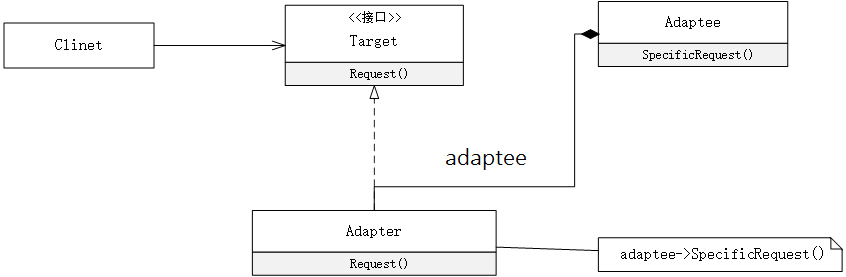
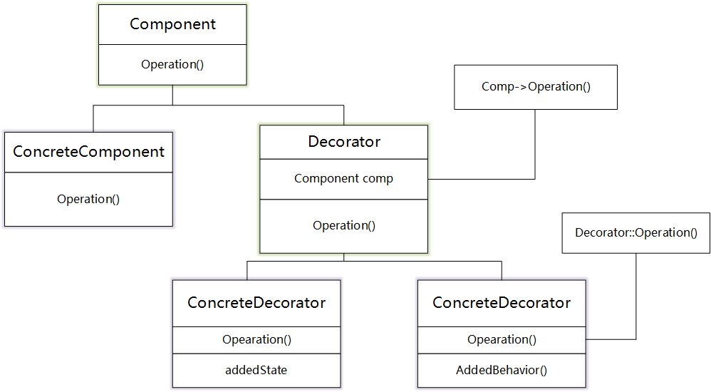
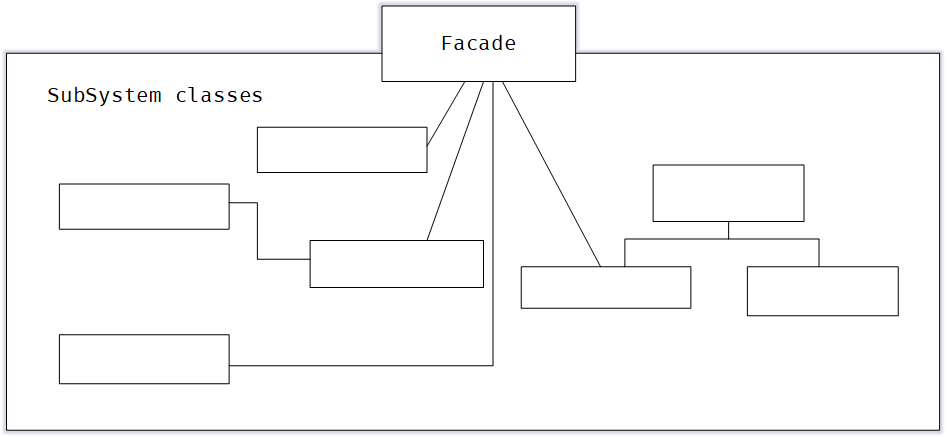
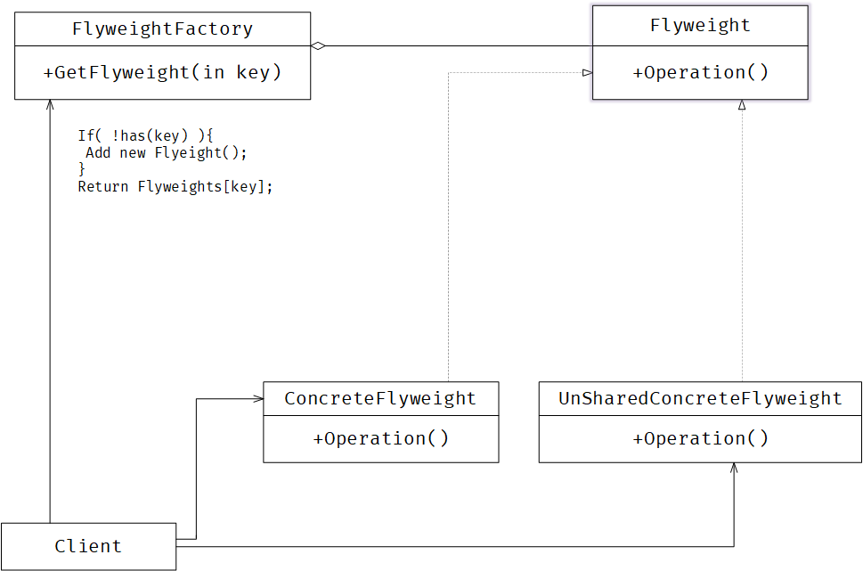
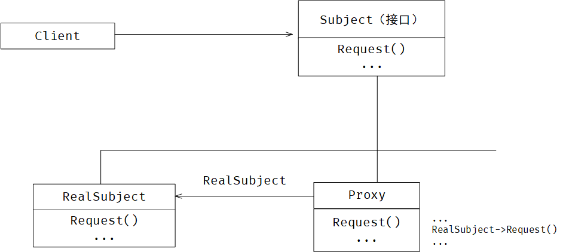

# Structural 

> 定义：结构型模式涉及到如何组合类和对象以获得更大的结构。结构型模式不是对接口和实现进行组合，而是描述了如何对一些对象进行组合，从而实现新功能的一种方法。

<br/>

## Adapter

### Ⅰ 模式意图

+ 将一个类的接口转换成客户希望的另一个接口，Adapter模式使得原本由于接口不兼容而不能一起工作的那些类可以一起工作 。


### Ⅱ 模式适用

+ 你想使用一个已经存在的类，而它的接口不符合你的需求。
+ 你想创建一个可以复用的类，该类可以与其它不相关的类或不可预见的类协同工作。


### Ⅲ 模式效果

+ 允许一个adapter与多个adaptee，即adaptee本身以及它的所有子类、组合类同时工作。
+ 使得重定义adapter的行为比较困难。


### Ⅳ 模式结构

+ `Target` 定义Client使用的与特定领域相关的接口。
+ `Clinet` 与符合Target接口的对象协同。
+ `Adaptee` 定义一个已经存在的接口，这个接口需要适配。
+ `Adapter` 对Adaptee的接口与Target接口进行适配





> + Clinet在Adpter实例上调用一些操作。接着适配器调用Adaptee的操作实现这个请求。

### Ⅴ 模式实现

```c++
// 转换的目标接口
class ITarget {
 public:
  virtual int request() = 0;
  virtual ~ITarget(){};
};
```

```c++
// 需要转换的对象类接口
class IAdaptee {
 public:
  virtual int SpecificRequest() = 0;
  virtual ~IAdaptee(){};
};
```

```c++
// 需要转换的具体类
class Asaptee : public IAdaptee {
 private:
  int data = 12;

 public:
  virtual int SpecificRequest() { 
      return this->data; 
  }
};
```

```c++
// 进行转换的适配器
class Adapter : public ITarget {
 private:
  IAdaptee* pAdaptee;
    
 public:
  Adapter(IAdaptee* adaptee) { 
      this->pAdaptee = adaptee; 
  }
  virtual int request() { 
      return pAdaptee->SpecificRequest() + 100; 
  }
};
```


### Ⅵ 相关模式

+ Bridge目的是将接口部分和实现分离，从而对它们可以较为简单相对独立的加以变化。而Adapter则改变一个已有对象的接口。
+ Decorator 支持递归组合，增强了其它对象的功能而同时又不改变它的接口。
+ Proxy 在不改变它的接口的条件下，为另一个对象定义了一个代理。


<br/>

## Bridge

### Ⅰ模式意图

+ 将抽象部分与它的实现部分分离，使他们都可以独立地变化。
+ 摆脱继承机制的不灵活，对不同维度的部分进行独立的修改、扩充和重用。


### Ⅱ 模式适用

+ 你不希望在抽象和它的实现部分之间有一个固定的绑定关系。
+ 类的抽象以及它的实现都应该可以通过生成子类的方法加以扩充。
+ 对一个抽象的实现部分的修改应对客户不产生影响。
+ 你想在多个对象间共享实现，但同时要求客户并不知道这一点。


### Ⅲ 模式效果

+ 分离接口及其实现部分
+ 提高可扩充性
+ 实现细节对客户的透明


### Ⅳ 模式结构

+ `Abstraction` 定义抽象类的接口；维护一个指向Implementor类型对象的指针
+ `RefinedAbstraction` 扩充由Abstraction定义的接口
+ `Implementor` 定义实现类的接口，并不一定要与Abstraction接口一致
+ `ConcreteImplementor` 实现Implementor接口并定义它的具体实现


> Abstraction将Client的请求转发给它的Implementor对象。


### Ⅴ 模式实现

#### 仅有一个Implementor(cc)

当仅有一个实现时，没有必要创建一个抽象的Implementor类；

```c++
// 抽象类
class Abstraction {
 protected:
  // 维护一个指向Implementor类型对象的指针
  Implementor* implementor;

 public:
  virtual int OperatorA() = 0;
  virtual int OperatorB() = 0;
  virtual ~Abstraction(){};
};
```

```c++
// 实现Implementor接口并定义它的具体实现
// 当仅有一个实现时，没有必要创建一个抽象的Implementor类；
class Implementor {
 public:
  int getColor() { return 0x12; }
  int getShap() { return 0x14; }
};
```

```c++
// 扩充由Abstraction定义的接口
class RefinedAbstraction : public Abstraction {
 public:
  RefinedAbstraction(Implementor* implementor) {
    this->implementor = implementor;
  }
  virtual int OperatorA() {
    int color = implementor->getColor();
    return color;
  }
  virtual int OperatorB() {
    int shap = implementor->getShap();
    return shap;
  }
  ~RefinedAbstraction() {
    if (implementor != nullptr) {
      delete implementor;
    }
  }
};
```

```c++
// 利用简单工厂创建
class AbstractionFactory {
 public:
  static Abstraction* createAbstraction() {
    return new RefinedAbstraction(new Implementor());
  }
};

int main() {
  Abstraction* Abstraction = AbstractionFactory::createAbstraction();
  printf("%d\n", Abstraction->OperatorA());
  printf("%d\n", Abstraction->OperatorB());
  return 0;
}
```


#### 创建正确Implementor(ts)

```typescript
interface Implementor {
    basePrice(): number
    name(): string
}

abstract class Abstraction {
    protected impl: Implementor;
    abstract getStd(): string;
    abstract getPro(): string;
}

class RefinedAbstraction extends Abstraction {
    constructor(implementor: Implementor) {
        super()
        this.impl = implementor;
    }
    public getStd(): string {
        return `${this.impl.name()} std: ${this.impl.basePrice() * 5}`
    }
    public getPro(): string {
        return `${this.impl.name()} pro: ${this.impl.basePrice() * 10}`
    }
}

// 具体的实现类
class ConcreteImplementorWin implements Implementor {
    public basePrice(): number {
        return 10
    }

    public name(): string {
        return "win"
    }
}

class ConcreteImplementorLinux implements Implementor {
    public basePrice(): number {
        return 5
    }

    public name(): string {
        return "Linux"
    }
}

export function NewBridgeLinux():Abstraction{
    return new RefinedAbstraction(new ConcreteImplementorLinux());
}

export function NewBridgeWin():Abstraction{
    return new RefinedAbstraction(new ConcreteImplementorWin());
}
```

[更多代码](/src/DesignPattern/Structural/Component/)

### Ⅵ 模式相关

+ `Abstract Factory` 模式可以用来创建和配置一个特定的`Bridge`模式。
+ `Adapter` 模式用来帮助无关的类协调工作，它通常在系统设计完成后才被使用。然而`Bridge`模式则是在系统开始时就被使用，它使得抽象接口和实现部分可以独立的改变。


<br/>

## Composite

### Ⅰ模式意图

+ 将对象组合成树形结构以表示“部分-整体”的层次结构。`Conposite`使得用户对单个对象和组合对象的使用具有一致性。
+ `Conposite` 模式的关键是一个抽象类，它既可以表示图元，又可以代表图元的容器。


### Ⅱ 模式适用

+ 你想表示对象的部分—整体层次结构。
+ 你希望用户忽略组合对象与单个对象的不同，用户将统一地使用组合结构中的所有对象。


### Ⅲ 模式效果

+ 定义了包含基本对象和组合对象的类层次结构。
+ 简化客户代码
+ 使得更容易增加新类型的组件
+ 使你的设计变得更加一般化


### Ⅳ 模式结构

+ `Component` 为组合的对象声明接口，在适合的情况下，实现所有类共有接口的省却行为，声明一个接口用于访问和管理Component的子组件，（回溯访问父组件）
+ `Leaf` 在组合中表示叶节点对象，叶节点没有子节点；在组合中定义图元对象的行为；
+ `Composite` 定义有子部分的那些部分的行为；储存子部分；在Component接口中实现与子部分有关的操作；
+ `Client` 通过Component接口操作组合部分的对象


> + 用户使用Component类接口与组合结构中的对象进行交互。如果接收者是一个叶节点，则直接处理请求。如果接收者是Composite，它通常将请求发送给它的子部件，在转发请求之前与/或之后可能执行一些辅助操作。


### Ⅴ 模式实现

+ 显示的父部件引用
+ 共享组件
+ 最大化Component接口
+ 声明管理子部分的操作

+ Component是否应该实现一个Component列表
+ 子部分排序
+ 使用高速缓冲存贮改善性能
+ 应该由谁删除Component
+ 存贮组件最好用哪一种数据结构（数据结构的选择取决于效率）


```typescript
export abstract class Component {
    protected data: number;
    abstract Print();
    abstract Increase();
    abstract Add(compl:Component);
}

export class Composite extends Component {
    private Components: Array<Component>;
    constructor(n: number) {
        super()
        this.data = n;
        this.Components = new Array<Component>();
    }
    public Add(compl:Component){
        this.Components.push(compl);
    }
    public Print() {
        console.log("Composite %d",this.data);
        for (const iterator of this.Components) {
            iterator.Print();
        }
    }
    public Increase() {
        this.data++;
        for (const iterator of this.Components) {
            iterator.Increase();
        }
    }
}

export class Leaf extends Component{
    constructor(n:number){
        super()
        this.data = n;
    }
    public Add(compl:Component){
        throw "叶子类无法添加子类";
    }
    public Increase(){
        this.data++;
    }
    public Print(){
        console.log("Leaf %d",this.data);
    }
}
```

```typescript
const root: Component = new Composite(0);
root.Add(new Leaf(1))
root.Add(new Leaf(2))
let compl = () => {
    let p = new Composite(12);
    p.Add(new Leaf(19));
    p.Add(new Leaf(67));
    return p;
}
root.Add(compl());

root.Print();
root.Increase();
root.Print();
```


### Ⅵ 模式相关

+ 通常部件——父部件连接用于Responsibility of Chain模式

+ Decorator 模式经常与Composite模式一起使用。当装饰和组合一起使用时，它们通常有一个公共的父类。因此装饰必须支持具有Add、Remove和GetChild操作的Component接口
+ Flyweight让你共享组件，但不能引用他们的父部件
+ Itertor可用于遍历Composite
+ Visitor将本来应该分布在Composite和Leaf类中的操作和行为局部化；


<br/>

## Decorator

### Ⅰ 模式意图

+ 动态地给一个对象**添加一些额外的职责**，就增加功能来说，Decorator模式相比生成子类更为灵活。


### Ⅱ 模式适用

+ 在不影响其它对象的情况下，以动态、透明的方式给单个对象添加职责；
+ 处理那些可以撤销的职责；
+ 当不能采用生成子类的方法进行扩充时。


### Ⅲ 模式效果

+ 比静态继承更灵活
+ 避免在层次结构高层的类有太多的特性；
+ Decorator与它的Component不一样；
+ 有许多小对象；


### Ⅳ 模式结构

+ `Component` 定义一个对象接口，可以给这些对象动态地添加职责；
+ `ConcreteComponent` 定义一个对象，可以给这个对象添加一些职责；
+ `Decorator` 维持一个指向Component对象的指针，并定义一个与Component接口一致的接口；
+ `ConcreteDecorator` 向组件添加职责；




> + Decorator 将请求转发给它的Component对象，并有可能在转发请求前后执行一些附加操作。

### Ⅴ 模式实现

```c++
class Component {
 public:
  virtual ~Component(){};
  virtual int Count() = 0;
};

// 具体的执行对象
class ConcreteComponent : public Component {
 public:
  virtual int Count() {
    std::cout << "std 10" << std::endl;
    return 10;
  }
};

// 装饰器类
class Decoretor : public Component {
 public:
  Decoretor(Component* component) : _component(component){};
  virtual ~Decoretor(){};
  virtual int Count() { 
    return this->_component->Count(); 
  };

 protected:
  Component* _component;
};

// 具体的类
class ConcreteDecoratorA : public Decoretor {
 public:
  ConcreteDecoratorA(Component* component) : Decoretor(component){};
  virtual int Count() {
    std::cout << "add price 5" << std::endl;
    return 5 + Decoretor::Count();
  };
};

// 具体的类
class ConcreteDecoratorB : public Decoretor {
 public:
  ConcreteDecoratorB(Component* component) : Decoretor(component){};
  virtual int Count() {
    std::cout << "add price 8" << std::endl;
    return 8 + Decoretor::Count();
  };
};
```

```c++
int main() {
  Component* s1 = new ConcreteComponent();
  // 使用上层层包裹
  Component* dec = new ConcreteDecoratorA(s1);
  Component* dec2 = new ConcreteDecoratorB(dec);

  std::cout << dec2->Count() << std::endl;

  delete s1;
  delete dec;
  delete dec2;
}
```


### Ⅵ 相关模式

+ Adapter模式：Decorator模式不同于Adapter模式，因为装饰仅改变对象的职责而不改变它的接口，而适配器将给对象一个全新的接口；
+ Composite模式：可以将装饰器视为一个退化的，仅有一个组件的组合。然而，装饰仅给对象添加一些额外的职责——它的目的不在于对象聚合；
+ Strategy模式：用一个装饰器你可以改变对象的外表；而Strategy模式使得你可以改变对象的内核。这是改变对象的两种途径；


<br/>


## Facade

### Ⅰ 模式意图

+ 为子系统中的一组接口提供一个一致的界面，Facade模式定义了一个高层接口，这个接口使得这个子系统更加容易使用。


### Ⅱ 模式适用

+ 当你要为一个复杂子系统提供一个简单接口时。
+ 客户程序与抽象类的实现部分之间存在着很大的依赖性。引入facade将这个子系统与客户以及其他的子系统分离，可以提高子系统的独立性和可以移植性。
+ 当你需要构建一个层次结构的子系统时，使用facade模式定义子系统中每层的入口点。如果子系统之间是相互依赖的，你可以让它们仅通过facade进行通讯，从而简化了它们之间的依赖。


### Ⅲ 模式效果

+ 它对客户屏蔽子系统组件，因而减少了客户处理的对象的数目并使得子系统使用起来更加方便
+ 它实现了子系统与客户之间的松耦合关系，而子系统的内部组件往往是紧耦合的。**有利于建立层次关系**，可以**消除复杂的循环依赖关系**。
+ 如果应用需要，**它并不限制它们使用子系统类**。因此你可以在系统易用性和通用性之间权衡。


### Ⅳ 模式结构

+ `Facade` 知道那些子系统类负责处理请求。将客户的请求代理给适当的子系统对象。
+ `Subsystem Classes` 实现子系统的功能；处理由Facaded对象指派的任务。没有facade的任何相关信息，即没有指向Facade的指针。



> + 客户程序通过发送请求给Facade的方式与子系统通讯。facade将这些信息转发给适当的子系统对象。尽管是子系统中的有关对象在做实际工作，但Facade模式本身也必须将它的接口转换成子系统的接口。

### Ⅴ 模式实现

```c++
class IFacade {
 public:
  virtual void TurnOff() = 0;
  virtual void PlayMusic() = 0;
  virtual ~IFacade(){};
};

class Light {
 public:
  void TurnOffLight() { printf("turn off the light\n"); }
};

class Mp3 {
 public:
  void PlayMusic() { printf("mp3 play music\n"); }
};

class Facade : public IFacade {
 private:
  Light* light;
  Mp3* mp3;

 public:
  Facade() {
    this->light = new Light();
    this->mp3 = new Mp3();
  }
  virtual void TurnOff() { this->light->TurnOffLight(); }
  virtual void PlayMusic() { this->mp3->PlayMusic(); }
  
  ~Facade() {
    delete light;
    delete mp3;
  }
};
```

```c++
int main() {
  IFacade* f = new Facade();
  f->TurnOff();
  f->PlayMusic();
  delete f;
  return 0;
}
```


### Ⅵ 相关模式

+ `Abstract Factory`Abstract Factory 可以与Facade模式一起使用以提供一个接口，这一接口可用来以一种子系统独立的方式创建子系统对象。Abstract Factory 也可以替换Facade模式隐藏那些与平台相关的类。
+ `Mediator` Medistor模式目的是对同事之间的任意通讯进行抽象，**通常集中不属于任何单个对象的功能**。Medistor的同事对象知道中介者并与它通信，Facade模式仅对子系统接口进行抽象，**它并不定义新功能**，**子系统也不知道facade的存在**。 
+ `Sinaleton` 通常来讲，仅需要一个Facade对象，因此Facade对象通常属于Sinaleton模式。


<br/>

## Flyweight

### Ⅰ 模式意图

+ 运用共享技术有效地支持大量细粒度的对象。


### Ⅱ 模式适用

+ 一个应用程序使用了大量的对象
+ 完全由于使用大量对象，造成很大的存储开销
+ 对象的大多数状态都可变为外部状态
+ 如果删除对象的外部状态，那么可以用相对较小的共享对象取代很多组对象
+ 应用程序不依赖于对象的标识


### Ⅲ 模式效果

+ **时间和空间的权衡**
+ **用共享减少内部状态的消耗，用计算时间换取对外部状态的存储**
+ 因为共享，实例的总数目减少


### Ⅳ 模式结构

+ `Flyweight` 描述一个接口，通过这个接口flyweight可以接受并作用于内部状态
+ `ConcreteFlyweight` 实现Flyweight接口，并为内部状态增加储存空间
+ `UnsharedConcreteFlyweight` 并非所有的flyweight需要被共享
+ `FlyweightFactory` 管理并创建flyweight对象，确保合理地共享flyweight。





> + flyweight执行时所需的状态必定是内部或是外部的。
> + 用户不应直接对ConcreteFlyweight进行实例化，只能通过FlyweightFactory


### Ⅴ 模式实现

+ 删除外部状态
+ 管理共享对象

```c++
// 享元抽象类
class Flyweight {
 protected:
  char value;

 public:
  virtual char getValue() = 0;
  virtual ~Flyweight(){};
};

// 享元具体类
class ConcreteFlyweight : public Flyweight {
 public:
  ConcreteFlyweight(char val) { this->value = val; }
  virtual char getValue() { return this->value; }
};

// 享元工厂
class FlyweightFactory {
 private:
  std::map<char, Flyweight*> cache;

 public:
  Flyweight* GetFlyweight(char sign) {
    std::map<char, Flyweight*>::iterator it;
    it = this->cache.find(sign);

    if (it == this->cache.end()) {
      Flyweight* item = new ConcreteFlyweight(sign);
      this->cache.insert(std::pair<char, Flyweight*>(sign, item));
      return item;
    }
    return cache[sign];
  };

  void Clear() {
    for (auto it = cache.begin(); it != cache.end(); it++) {
      auto item = it->second;
      delete item;
    }
    this->cache.clear();
  }
};

```

```c++
int main(){
    auto f = new FlyweightFactory();
    auto item1 = f->GetFlyweight('a');
    auto item2 = f->GetFlyweight('a');
    auto item3 = f->GetFlyweight('b');
    printf("%d %p\n",item1->getValue(),item1);
    printf("%d %p\n",item2->getValue(),item2);
    printf("%d %p\n",item3->getValue(),item3);

    f->Clear();
    delete f;
}
```


### Ⅵ 相关模式

+ `Composite` flyweight模式通常和Composite模式结合使用，用共享叶结点的有向无环图实现一个逻辑上的层次结构
+ `Strate` 通常最好用Flyweight实现State和Strategy对象


<br/>

## Proxy

### Ⅰ 模式意图

+ 为其他对象提供一种代理以控制对这个对象的访问


### Ⅱ 模式适用

+ **远程代理**： 为一个对象在不同的地址空间提供局部代理。

+ **虚代理**：根据需要创建开销很大的对象

+ **保护代理**：控制对原始对象的访问。控制权限

+ **智能指引**：取代了简单的指针，它在访问对象时执行一些附加操作

  + 引用计数，自动释放

  + 第一次访问持久对象，将它装入内存

  + 在访问一个实际对象前，检查是否已经锁定了它

     

### Ⅲ 模式效果

+ 引入了间接性
+ **Remote Proxy** 可以隐藏一个对象存在于不同地址空间的事实
+ **Virtual Proxy** 可以进行最优化，根据要求创建对象
+ **Protection Proxies**和**Smart Reference** 都允许在访问一个对象时有一些附加的内务处理。


### Ⅳ 模式结构

+ `Proxy` 保存一个引用使得代理可以访问实体；控制实体的存放，并可能负责创建和删除
+ `Subject` 定义RealSubject和Proxy的共用接口，这样就在任何使用RealSubject的地方都可以使用Proxy
+ `RealSubject` 定义Proxy所代表的实体





> + 代理根据其种类，在适当的时候向RealSubject转发请求

### Ⅴ 模式实现

```c++
class Subject {
 public:
  virtual void TouchFile() = 0;
  virtual ~Subject(){};
};

class RealSubject : public Subject {
 public:
  virtual void TouchFile() {
    std::ofstream outfile("a.txt");
    if (!outfile) exit(0);

    outfile << "touch file a.txt\n";
    outfile.close();
  }
};

class Proxy : public Subject {
 public:
  virtual void TouchFile() {
    Subject* realSubject = new RealSubject();
    realSubject->TouchFile();
    delete realSubject;
  }
};
```

```c++
int main(){
    Subject* handle = new Proxy();
    handle->TouchFile();
}
```


### Ⅵ 相关模式

+ `Adapter` 适配器Adapter为它所适配的对象提供了一个不同的接口，代理提供了与它的实体相同的接口。
+ `Decorator` 尽管decorator的实现部分与代理相似，但decorator的目的不一样，Decorator为对象添加一个或多个功能，而代理则控制对对象的访问。

