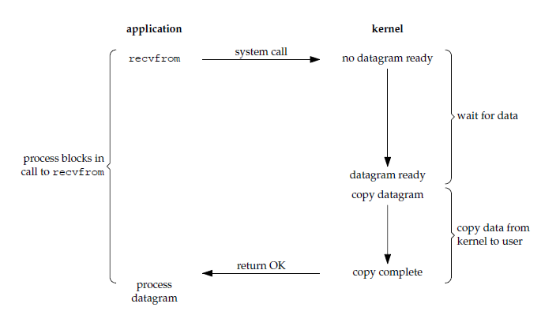

# IO 模型

## Index

+ 同步模型

  + 阻塞 IO
  + 非阻塞 IO
  + 多路复用 IO
  + 信号驱动 IO

+ 异步模型

  + 异步 IO

  

## Block I/O

> **阻塞I/O模型** ：广义的阻塞模型是指线程之间通讯时，只有在等待请求正确结果返回后，任务才继续执行；在系统层，进行系统调用后，内核处理完成后才返回，等待期间当前线程会被挂起，处于不可中断的挂起状态。直到操作系统通知完成，才继续执行。



### BlockIO.TcpServer

+ 产生阻塞的系统调用 `accept()` `recv()` 

```c
// runtime: win10-x64;
SOCKET createTcpSocket() {
  SOCKET result = socket(AF_INET, SOCK_STREAM, IPPROTO_TCP);
  return result;
}

struct sockaddr_in createSocketConfig(u_short hostshort) {
  struct sockaddr_in result;
  result.sin_family = AF_INET;
  result.sin_port = htons(hostshort);
  result.sin_addr.S_un.S_addr = INADDR_ANY;
  return result;
}


void handleLoop(SOCKET aSocket) {

  char* buffer = malloc(sizeof(char) * BUFFER_SIZE);
  memset(buffer, 0, BUFFER_SIZE);
  while (TRUE) {
    printf("******** sys recv() ********\n");
    // 阻塞的系统调用，调用不返回时线程被挂起。
    int ret = recv(aSocket, buffer, 255, 0);
    
    if (ret > 0) {
      buffer[ret] = 0x00;
      printf("%s\n", buffer);
    }
    if (ret == 0) {
        closesocket(aSocket);
        break;
    }
  }
  free(buffer);
}

int main() {
  // win下设置dll版本
  WSADATA wsaData;
  WSAStartup(MAKEWORD(2, 2), &wsaData);

  // 创建服务器 主socket
  SOCKET server = createTcpSocket();
  SOCKADDR_IN serverAddr = createSocketConfig(3000);

  // 绑定端口
  bind(server, (PSOCKADDR)&serverAddr, sizeof(serverAddr));

  // 系统调用函数 listen(), 
  //1. 将一个未连接的套接字转换为被动套接字，指示内核应该接收指向该套接字的连接请求。
  //2. 指定内核应该为相应的套接字队列的最大连接个数。
  listen(server, 1);

  while (TRUE) {
    // 用于储存客户端socket地址
    struct sockaddr_in clientAddrBuffer;
    int addr_len = sizeof(clientAddrBuffer);

    // systemCall: accept()
    // 用于内核返回下一个已完成连接。如果已完成连接队列为空，则阻塞线程处于挂起状态。
    printf("******* sys accept() ********\n");
    SOCKET clientSocket = accept(server, (PSOCKADDR)&clientAddrBuffer, &addr_len);
    
    handleLoop(clientSocket);
  }

  closesocket(server);
  WSACleanup();
  return 0;
}
```


## NonBlock I/O

> **非阻塞io本质上是一种轮询策略，检测是否准备完成交给用户态。**在执行系统调用之后，内核直接返回一个错误码(只有完成之后才返回正确的标识码)。由用户态进行轮询，不断的执行系统调用来查看 I/O 是否完成。
>
> 由于处理更多的系统调用，因此这种模型的 CPU 利用率比较低，**但是线程不会长时间挂起，可以在等待的同时处理其它的事件**。


### NonBlockIO.TcpServer

+ 重点轮询操作

```c++
// runtime: win10-x64;
class Server {
 private:
  typedef DWORD (*pFunc)(PVOID);

  WSADATA wsaData;
  SOCKET serverSocket;
  SOCKADDR_IN serverAddr;
  pFunc handleFunc;
  int iMode;

  SOCKADDR_IN createSocketConfig(u_short port) {
    SOCKADDR_IN result;
    result.sin_family = AF_INET;
    result.sin_port = htons(port);
    result.sin_addr.S_un.S_addr = INADDR_ANY;
    return result;
  }

  SOCKET createTcpSocket() { 
      return socket(AF_INET, SOCK_STREAM, IPPROTO_TCP); 
  }

  // 接受连接的循环
  void acceptLoop() {
    while (true) {
      struct sockaddr_in clientAddrBuffer;
      int addr_len = sizeof(clientAddrBuffer);

      // systemCall: accept()
      // 用于内核返回下一个已完成连接。如果已完成连接队列为空，则阻塞线程处于挂起状态。
      SOCKET clientSocket =
          accept(serverSocket, (PSOCKADDR)&clientAddrBuffer, &addr_len);
      printf("******* accept polling ********\n");

      // 轮询
      if (clientSocket == INVALID_SOCKET) {
        //表示没有客户端发起连接，继续循环
        if (WSAGetLastError() == WSAEWOULDBLOCK) {
          Sleep(1000);
          continue;
        } else {
          printf("accept failed!\n");
        }
      }

      handleFunc((PVOID)clientSocket);
    }
  }
  // 设置网络io为非阻塞模式
  void setIoNonBlock() {
    this->iMode = 1;
    ioctlsocket(serverSocket, FIONBIO, (u_long FAR*)&iMode);
  }

 public:
  Server() {
    printf("wsaStartup ...\n");
    WSAStartup(MAKEWORD(2, 2), &(this->wsaData));
    printf("create main socket\n");
    this->serverSocket = createTcpSocket();
  }

  void setHandleFunc(pFunc aHandleFunc) { 
      this->handleFunc = aHandleFunc; 
  }

  void bindAndListen(u_short port) {
    this->serverAddr = createSocketConfig(port);
    bind(serverSocket, (PSOCKADDR)&serverAddr, sizeof(serverAddr));
    listen(serverSocket, 1);
    this->setIoNonBlock();
    this->acceptLoop();
  }

  ~Server() {
    closesocket(serverSocket);
    WSACleanup();
  }
};
```

```c++
char* createBuffer(int len) {
  char* result = new char[len];
  memset(result, 0, len);
  return result;
}

void fillStringEnd(char* str, int index) { 
    str[index] = 0x00; 
}

DWORD handleFunc(PVOID pSocket) {
  SOCKET aSocket = (SOCKET)pSocket;

  char* buffer = createBuffer(1024);

  while (TRUE) {
    int ret = recv(aSocket, buffer, 255, 0);
    printf("******** recv polling ********\n");

    if (ret == SOCKET_ERROR) {
      int errcode = WSAGetLastError();
      if (errcode == WSAEWOULDBLOCK) {
        Sleep(100);
        continue;
      } else {
        printf("xxxxx recv error xxxxxxx\n");
        return -1;
      }
    }
	if (ret > 0) {
      fillStringEnd(buffer, ret);
      printf("%s\n", buffer);
    } 
    else if (ret == 0) {
      printf("client socket closed\n");
      break;
    } 
  }

  delete[] buffer;
  closesocket(aSocket);
  return 0;
}

int main() {
  Server server;
  server.setHandleFunc(handleFunc);
  server.bindAndListen(3000);
}
```


## Multiplexing I/O

> **单线程具有处理多个 I/O 事件的能力。又被称为 Event Driven I/O，即事件驱动 I/O**。
>
> **非阻塞io模拟实现**：将io设置为非阻塞，将多个io封装成数组进行轮询，系统调用检测是否有数据。用户态轮询需要反复进行系统调用，内核态切换产生大量开销。
>
> **系统支持**：提供如select函数， **由内核接管轮询**（**此处会进行阻塞，线程挂起**）。有io描述符可读写时返回（返回数量），之后用户态遍历检测具体的的io，利用系统函数把对应的数据从内核空间复制到进程中。


### MultIO.select.TcpServer

```c
// runtime: winx64
#define BUFFER_SIZE 255  // io缓冲区大小

// 文件描述符池
//int sockNum = 0;
SOCKET GlobSocksPool[FD_SETSIZE];

// 服务器socket和addr打包一起
typedef struct SocketPack {
  SOCKET socket;
  SOCKADDR_IN addr;
} SOCKETPACK;

void cleanGlobSocksPool() {
  for (int i = 0; i < FD_SETSIZE; i++) {
    GlobSocksPool[i] = INVALID_SOCKET;
  }
}

// 处理错误
void errorHandler(const char* message) {
  printf("%s\n", message);
  exit(1);
}

void printBufferIO(char* buffer, int len) {
  buffer[len] = 0x00;
  printf("%s\n", buffer);
}

// 创建用于监听的socket
SOCKET createServTCPSocket() {
  SOCKET result = socket(AF_INET, SOCK_STREAM, IPPROTO_TCP);
  if (result == INVALID_SOCKET) errorHandler("socketServ error");
  return result;
}

// 创建用于监听的socket的地址
SOCKADDR_IN createServAddr(u_short port) {
  SOCKADDR_IN result;
  memset(&result, 0, sizeof(result));
  result.sin_family = AF_INET;
  result.sin_port = htons(port);
  result.sin_addr.S_un.S_addr = INADDR_ANY;
  return result;
}

// NewServer 创建服务器主socket和addr的结构体
// 使用createServerAddr和createServerTCPSocket
SOCKETPACK NewServer() {
  SOCKETPACK result;
  result.socket = createServTCPSocket();
  result.addr = createServAddr(3000);
  return result;
}

// 服务器主socket，绑定端口并开启监听
void bindAndListen(SOCKETPACK* serv) {
  int error;
  error = bind(serv->socket, (PSOCKADDR)&serv->addr, sizeof(serv->addr));
  if (error == SOCKET_ERROR) {
    errorHandler("bind error");
  }
  error = listen(serv->socket, 64);
  if (error == SOCKET_ERROR) {
    errorHandler("listen error");
  }
}

void removeDeathSocket(SOCKET* sockPool, int index, fd_set* pFds) {
  printf("client socket closed ...\n");
  closesocket(sockPool[index]);
  FD_CLR(sockPool[index], pFds);
  sockPool[index] = INVALID_SOCKET;
}

void recvMessage(char* buffer, fd_set* pFds, fd_set* pCopyRead) {
  for (int i = 1; i < FD_SETSIZE; i++) {
    if (GlobSocksPool[i] == INVALID_SOCKET) continue;

    if (FD_ISSET(GlobSocksPool[i], pCopyRead)) {
      int strLen = recv(GlobSocksPool[i], buffer, BUFFER_SIZE, 0);

      //客户端断开了连接
      if (strLen <= 0) {
        removeDeathSocket(&GlobSocksPool[0], i, pFds);
        //sockNum--;
      }
      //客户端发送了数据
      else if (strLen > 0)
        printBufferIO(buffer, strLen);
    }
  }
}

// 多路复用io
void MultiplexingSocket(SOCKET servSock) {
  unsigned long ul = 1;
  // 请求的客户端
  int clntAddrSz;
  SOCKADDR_IN clntAddr;
  SOCKET clntSock;

  char buffer[BUFFER_SIZE];

  fd_set fds, copyRead;

  //遍历socks，将所有的元素置于无效的socket
  cleanGlobSocksPool();

  // 把监听accept的socket放入池中
  GlobSocksPool[0] = servSock;
  //sockNum += 1;

  FD_ZERO(&fds);
  FD_SET(servSock, &fds);

  while (TRUE) {
    copyRead = fds;

    int selResult = select(0, &copyRead, NULL, NULL, NULL);
    printf("select loop selResult %d\n", selResult);

    // 判断是否是新的客户端连接
    if (FD_ISSET(GlobSocksPool[0], &copyRead)) {
      printf("new accept\n");

      clntAddrSz = sizeof(clntAddr);
      clntSock = accept(servSock, (PSOCKADDR)&clntAddr, &clntAddrSz);

      for (int i = 1; i < FD_SETSIZE; i++) {
        if (GlobSocksPool[i] == INVALID_SOCKET) {
          GlobSocksPool[i] = clntSock;
          FD_SET(clntSock, &fds);
          break;
        }
      }
      continue;
    }
    // 接收信息
    recvMessage(buffer, &fds, &copyRead);
  }
}

int main() {
  WSADATA wsaData;
  if (WSAStartup(MAKEWORD(2, 2), &wsaData) == SOCKET_ERROR) {
    errorHandler("WSAStartUp Error");
  }

  SOCKETPACK socketServer = NewServer();
  bindAndListen(&socketServer);

  // 执行多路复用
  MultiplexingSocket(socketServer.socket);

  closesocket(socketServer.socket);
  WSACleanup();
  return 0;
}

```


### MultIO.poll.TcpServer

```c
// runtime: linux

#define BUF_SIZE 255
#define POLL_SIZE 20
#define PORT 3000

typedef struct servConfig{
    struct sockaddr_in addr;
    socklen_t socketLen;
} ServConfig;

int main(){

    ServConfig config = newServConfig();
    int serverFd = newServer();

    bindAndListen(serverFd, &config);
    pollLoop(serverFd);

    return 0;
}
// 服务器监听socke配置
ServConfig newServConfig(){
    ServConfig result;
    result.addr.sin_family = AF_INET;
    result.addr.sin_port = htons(PORT);
    result.addr.sin_addr.s_addr =  htonl(INADDR_ANY);
    result.socketLen = sizeof(result.addr);
    return result;
}

int newServer(){
    int result = socket(AF_INET, SOCK_STREAM, IPPROTO_TCP);
    if(result == -1) exit(1);
    return result;
}

void bindAndListen(int aSockFd, ServConfig* aConf){
    bind(aSockFd,(struct sockaddr *)&aConf->addr, aConf->socketLen);
    listen(aSockFd, 64);
}


void pollLoop(int aServ) {
  char buffer[BUF_SIZE];
  struct pollfd socksPool[POLL_SIZE];

  for (int i = 1; i < POLL_SIZE; ++i) {
    socksPool[i].fd = -1;
  }
  socksPool[0].fd = aServ;
  socksPool[0].events = POLLIN;

  struct sockaddr_in cliaddr;
  int clilen = sizeof(cliaddr);
  int ndfs = 0;
  while (1) {
    int nready = poll(socksPool, ndfs + 1, -1);
    if (socksPool[0].revents & POLLIN) {
      int connfd = accept(aServ, (struct sockaddr *)&cliaddr, &clilen);
      printf("accpet a new client: %s:%d\n", inet_ntoa(cliaddr.sin_addr),
             cliaddr.sin_port);

      for (int i = 1; i < POLL_SIZE; i++) {
        if (socksPool[i].fd < 0) {
          socksPool[i].fd = connfd;
          socksPool[i].events = POLLIN;
          if (i > ndfs) {
            ndfs = i;
            break;
          }
        }
      }
      if (--nready < 0) continue;
    }

    for (int i = 1; i <= ndfs; ++i) {
      if (socksPool[i].fd < 0) continue;
      if (socksPool[i].revents & POLLIN) {
        int nRed = recv(socksPool[i].fd, buffer, BUF_SIZE, 0);
        if (nRed <= 0) {
          printf("close client socket\n");
          close(socksPool[i].fd);
          socksPool[i].fd = -1;
        } else {
          buffer[nRed] = 0x00;
          printf("recv %s\n", buffer);
        }
        if (--nready <= 0) break;
      }
    }
  }
}
```


### MultIO.epoll.TcpServer

+  LT 模式

当 epoll_wait() 检测到描述符事件到达时，将此事件通知进程，进程可以不立即处理该事件，下次调用 epoll_wait() 会再次通知进程。是默认的一种模式，并且同时支持 Blocking 和 No-Blocking。

+ ET 模式

和 LT 模式不同的是，通知之后进程必须立即处理事件，下次再调用 epoll_wait() 时不会再得到事件到达的通知。

很大程度上减少了 epoll 事件被重复触发的次数，因此效率要比 LT 模式高。只支持 No-Blocking，以避免由于一个文件句柄的阻塞读/阻塞写操作把处理多个文件描述符的任务饿死。


```c
// runtime: linux
#define PORT 3000
#define BUFF_SIZE 255
#define EPOLL_SIZE 64

typedef struct servConfig{
    struct sockaddr_in addr;
    socklen_t socketLen;
} ServConfig;

int main() {
  ServConfig config = newServConfig();
  int serverFd = newServer();

  bindAndListen(serverFd, &config);
  epollLoop(serverFd);

  return 0;
}

ServConfig newServConfig() {
  ServConfig result;
  result.addr.sin_family = AF_INET;
  result.addr.sin_port = htons(PORT);
  result.addr.sin_addr.s_addr = htonl(INADDR_ANY);
  result.socketLen = sizeof(result.addr);
  return result;
}

int newServer() {
  int result = socket(AF_INET, SOCK_STREAM, IPPROTO_TCP);
  if (result == -1) exit(1);
  return result;
}

void bindAndListen(int aSockFd, ServConfig *aConf) {
  bind(aSockFd, (struct sockaddr *)&aConf->addr, aConf->socketLen);
  listen(aSockFd, 64);
}

void makeEpollEvent(struct epoll_event *ev, int fd) {
  ev->data.fd = fd;
  ev->events = EPOLLIN;
}

void epollLoop(int listenSock) {
  struct epoll_event events[EPOLL_SIZE], event;
  char buffer[BUFF_SIZE];

  int epollFd = epoll_create(EPOLL_SIZE);

  makeEpollEvent(&event, listenSock);
  epoll_ctl(epollFd, EPOLL_CTL_ADD, listenSock, &event);

  struct sockaddr_in ClientAddr;
  socklen_t CliLen = sizeof(ClientAddr);
  while (1) {
    int nfds = epoll_wait(epollFd, events, EPOLL_SIZE, -1);
    for (int i = 0; i < nfds; i++) {
      if (events[i].data.fd == listenSock) {
        int connSock = accept(listenSock, (struct sockaddr *)&ClientAddr, &CliLen);
        printf("new accept\n");
        makeEpollEvent(&event, connSock);
        epoll_ctl(epollFd, EPOLL_CTL_ADD, connSock, &event);
        continue;
      }

      int ret = recv(events[i].data.fd, buffer, BUFF_SIZE, 0);
      if (ret == 0) {
        close(events[i].data.fd);
        epoll_ctl(epollFd, EPOLL_CTL_DEL, events[i].data.fd, NULL);
        printf("client close socket ...\n");
      } else {
        buffer[ret] = 0x00;
        printf("%s\n", buffer);
      }
    }
  }
}
```


## Signal-drive I/O

> 应用进程使用 sigaction 系统调用，内核立即返回，应用进程可以继续执行，也就是说等待数据阶段应用进程是非阻塞的。内核在数据到达时向应用进程发送 SIGIO 信号，应用进程收到之后在信号处理程序中调用 recvfrom 将数据从内核复制到应用进程中。
>
> 相比于非阻塞式 I/O 的轮询方式，信号驱动 I/O 的 CPU 利用率更高。


## Async I/O

> 应用进程执行 aio_read 系统调用会立即返回，应用进程可以继续执行，不会被阻塞，内核会在所有操作完成之后向应用进程发送信号。
>
> 异步 I/O 与信号驱动 I/O 的区别在于，异步 I/O 的信号是通知应用进程 I/O 完成，而信号驱动 I/O 的信号是通知应用进程可以开始 I/O。


### AsyncIO.iocp.TcpServer

```c++
// runtime: win10-x64
#define MAX_BUFFER 1024
#define BACL_LOG 6

struct socketInfo {
  WSAOVERLAPPED overlapped;
  WSABUF dataBuf;
  SOCKET socket;
  char messageBuffer[MAX_BUFFER];
  int recvBytes;
};

class IOCompletionPort {
 public:
  IOCompletionPort();
  ~IOCompletionPort();

  bool init(u_short port);
  void startServer();
  bool createWorkerThread();
  void workerThread();

 private:
  socketInfo* pSocketInfo;
  SOCKET listenSocket;
  HANDLE hIocp;
  bool isAccept;
  bool isWorkerThread;
  HANDLE* pWorkerHandle;
};

// ===> 入口函数
int main() {
  IOCompletionPort iocpServer;

  if (iocpServer.init(8000)) {
    iocpServer.startServer();
  }

  return 0;
}
/* ====================== 实现 ======================= */

socketInfo* createSocketInfo(SOCKET aSocket) {
  socketInfo* result = new socketInfo();
  result->socket = aSocket;
  result->recvBytes = 0;
  result->dataBuf.len = MAX_BUFFER;
  result->dataBuf.buf = result->messageBuffer;
  return result;
}

unsigned int WINAPI CallWorkerThread(LPVOID p) {
  IOCompletionPort* pOverlappedEvent = (IOCompletionPort*)p;
  pOverlappedEvent->workerThread();
  return 0;
}

IOCompletionPort::IOCompletionPort() {
  isWorkerThread = true;
  isAccept = true;
}

IOCompletionPort::~IOCompletionPort() {
  WSACleanup();

  if (pSocketInfo != nullptr) {
    delete[] pWorkerHandle;
    pWorkerHandle = nullptr;
  }

  if (pWorkerHandle != nullptr) {
    delete[] pWorkerHandle;
    pWorkerHandle = nullptr;
  }
}

// 初始化监听socket
bool IOCompletionPort::init(u_short port) {
  WSADATA wsaData;
  int nResult;

  nResult = WSAStartup(MAKEWORD(2, 2), &wsaData);
  if (nResult != 0) {
    return false;
  }

  // 创建服务器socket
  listenSocket = WSASocketW(
      AF_INET, 
      SOCK_STREAM, 
      0, 
      nullptr, 
      0, 
      WSA_FLAG_OVERLAPPED
  );
  if (listenSocket == INVALID_SOCKET) {
    return false;
  }

  // 监听地址
  SOCKADDR_IN serverAddr;
  serverAddr.sin_family = AF_INET;
  serverAddr.sin_port = htons(port);
  serverAddr.sin_addr.S_un.S_addr = htonl(INADDR_ANY);

  // 绑定端口
  nResult = bind(listenSocket, (PSOCKADDR)&serverAddr, sizeof(SOCKADDR_IN));
  if (nResult == SOCKET_ERROR) {
    closesocket(listenSocket);
    WSACleanup();
    return false;
  }

  //监听
  nResult = listen(listenSocket, BACL_LOG);
  if (nResult == SOCKET_ERROR) {
    closesocket(listenSocket);
    WSACleanup();
    return false;
  }
  return true;
}

// 启动服务器
void IOCompletionPort::startServer() {

  // 客户端信息
  SOCKADDR_IN clientAddr;
  int addrLen = sizeof(SOCKADDR_IN);
  SOCKET clientSocket;
  DWORD recvBytes;
  DWORD flags;

  // 创建完成端口
  hIocp = CreateIoCompletionPort(INVALID_HANDLE_VALUE, nullptr, 0, 0);

  // 创建工作线程
  if (!this->createWorkerThread()) return;

  // 开始接受客户端循环
  while (this->isAccept) {
    clientSocket = WSAAccept(
        listenSocket, 
        (PSOCKADDR)&clientAddr, 
        &addrLen,
        nullptr, 
        (DWORD_PTR) nullptr
    );

    if (clientSocket == INVALID_SOCKET) exit(0);

    // 创建连接信息
    pSocketInfo = createSocketInfo(clientSocket);

    // 将客户端连接的新socket 绑定到完成端口
    flags = 0;
    hIocp = CreateIoCompletionPort(
        (HANDLE)clientSocket, 
        hIocp,
        (ULONG_PTR)pSocketInfo, 
        0
    );
    
    printf("accept a client socket\n");
    // 阻塞调用 指定嵌套套接字和传递函数在完成时执行
    // 第一次接收为0
    int nResult = WSARecv(
        pSocketInfo->socket, 
        &pSocketInfo->dataBuf, 
        1, 
        &recvBytes,
        &flags, 
        &(pSocketInfo->overlapped), 
        nullptr
    );
    if (nResult == SOCKET_ERROR && WSAGetLastError() != WSA_IO_PENDING) return;
  }
}

bool IOCompletionPort::createWorkerThread() {
  unsigned int threadId;
  // 获取操作系统信息
  SYSTEM_INFO sysInfo;
  GetSystemInfo(&sysInfo);
  printf("[INFO] CPU number : %lu\n", sysInfo.dwNumberOfProcessors);

  // 计算出需要创建的线程数量
  int nThreadCnt = sysInfo.dwNumberOfProcessors * 2;

  // 创建线程数组
  pWorkerHandle = new HANDLE[nThreadCnt];
  
  // 创建线程存放线程数组中
  for (int i = 0; i < nThreadCnt; i++) {
    pWorkerHandle[i] = (HANDLE*)_beginthreadex(
        NULL, 
        0, 
        &CallWorkerThread, 
        this,
        CREATE_SUSPENDED, 
        &threadId
    );
    if (pWorkerHandle[i] == NULL) {
      printf("[ERROR] Worker Thread create error\n");
      return false;
    }
    ResumeThread(pWorkerHandle[i]);
  }
  printf("[INFO] create Worker Thread success ...\n");
  return true;
}

void IOCompletionPort::workerThread() {

  // 重叠I / O操作中传输的数据大小
  DWORD recvBytes;
  socketInfo* pCompletionKey;
  socketInfo* pSocketInfo;
  DWORD dwFlags = 0;

  while (isWorkerThread) {

    // 阻塞调用
    bool bResult = GetQueuedCompletionStatus(
        hIocp, 
        &recvBytes,
        (PULONG_PTR)&pCompletionKey,
        (LPOVERLAPPED*)&pSocketInfo, 
        INFINITE
    );
    pSocketInfo->dataBuf.len = recvBytes;

    if (recvBytes == 0) {
      printf("[INFO] client close socket\n");
      closesocket(pSocketInfo->socket);
      delete pSocketInfo;
      continue;

    } else {
      printf("resv- Bytes[%lu], Msg : %s\n", pSocketInfo->dataBuf.len,
             pSocketInfo->dataBuf.buf);

      // 清理内存
      ZeroMemory(&(pSocketInfo->overlapped), sizeof(OVERLAPPED));
      pSocketInfo->dataBuf.len = MAX_BUFFER;
      pSocketInfo->dataBuf.buf = pSocketInfo->messageBuffer;
      ZeroMemory(pSocketInfo->messageBuffer, MAX_BUFFER);
      pSocketInfo->recvBytes = 0;
      

      // // 阻塞调用 WSARecv以从客户端接收响应
      dwFlags = 0;
      int nResult = WSARecv(pSocketInfo->socket, &(pSocketInfo->dataBuf), 1,
                        &recvBytes, &dwFlags,
                        (LPWSAOVERLAPPED) & (pSocketInfo->overlapped), NULL);

      if (nResult == SOCKET_ERROR && WSAGetLastError() != WSA_IO_PENDING) {
        printf("[ERROR] WSARecv error");
      }
    }
  }
}

```

