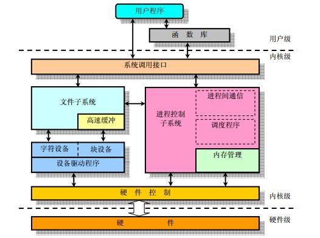
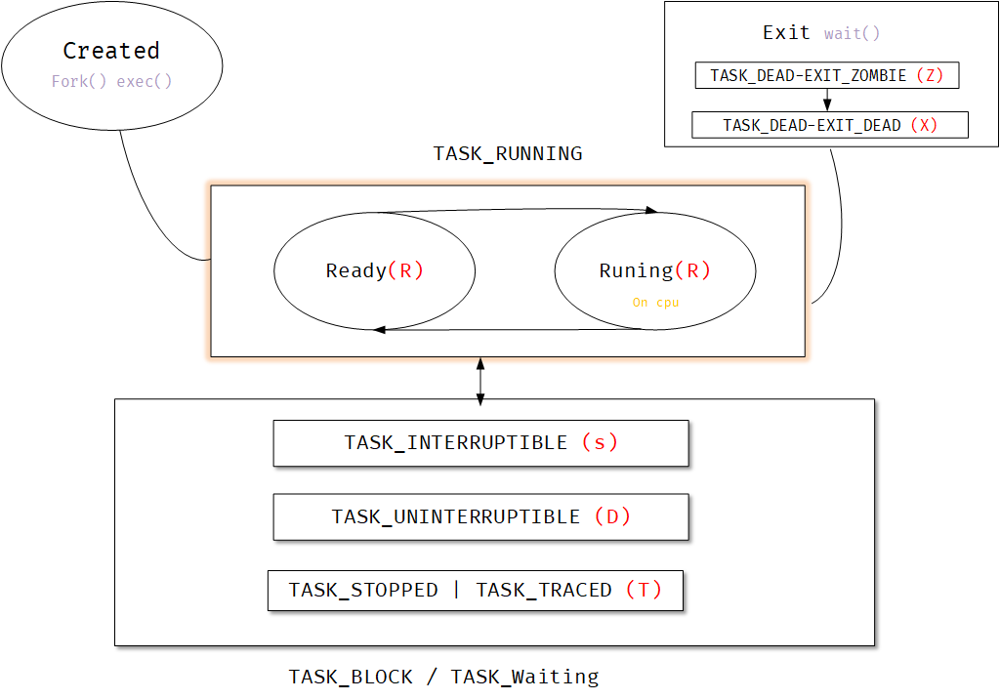
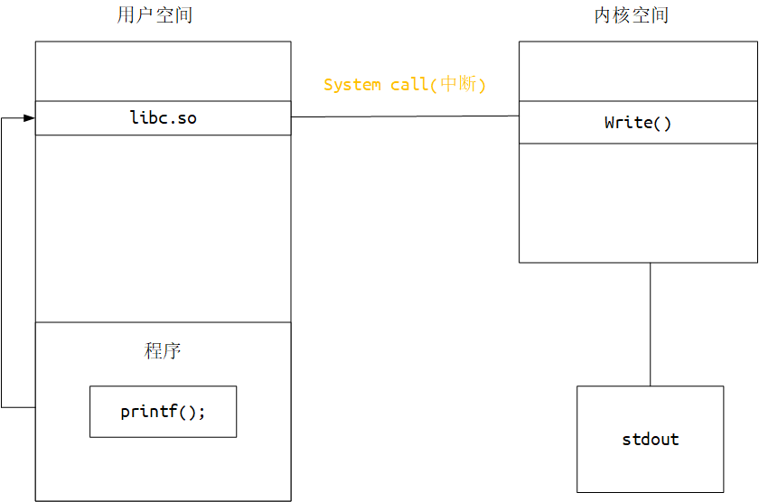

# Contour

## Index

> 操作系统轮廓。

### Bootloder

+ [BIOS]()
+ [EFI]()

### Disk

+ [Ext4]()
+ [Ntfs]()

### VMemory

+ [VM Mapping]()

### Process

+ [Primitive]()

+ [Process State]()

+ [PCB]()

+ [IPC]()

### SysCall

+ [Lib function](#LibFunction)

+ [Sys function]()

## Process

### Process State

> 进程状态

**linux进程状态**

+ TASK_RUNNING **可执行状态**（R）
  + 正在被调度(running)
  + 等待被调度(ready)

+ TASK_INTERRUPTIBLE **可中断的睡眠状态** (S)
  
  + 等待系统调用返回
+ TASK_UNINTERRUPTIBLE **不可中断的睡眠状态** (D)
  
  + 某些系统调用处理流程是不能被打断
+ TASK_STOPPED | TASK_TRACED **暂停或跟踪状态**  (T)
  
  + 等待跟踪它的进程对它进行操作
+ TASK_DEAD - EXIT_ZOMBIE **退出状态，僵尸进程** (Z)
  
  + 等待父进程回收PCB
+ TASK_DEAD - EXIT_DEAD **退出状态，进程即将被销毁** (X)
  
  + 进程彻底释放
  
  

**修饰符**

+ `< `   高优先级
+ `N`   低优先级
+  `L`  有些页被锁进内存
+ `s`   包含子进程

   +    `+`  位于后台的进程组；
   +    `l`    多线程，克隆线程 

## SysCall

### LibFunction

> 语言的标准函数，用于不同系统的跨平台。链接库封装了普通函数和系统调用函数。

标准函数例如c标准：`fopen()` `printf()` 

标注库(编译时链接)：`libc` `glibc` `mscrt`

#### 调用关系

#### 实现区别

标准函数带有其它操作，如io函数带有缓冲区，而系统函数比较存粹。

只有在缓冲区满，或者手动调用刷新时，标准函数会将内容一次写入内核空间。

### Sys function

